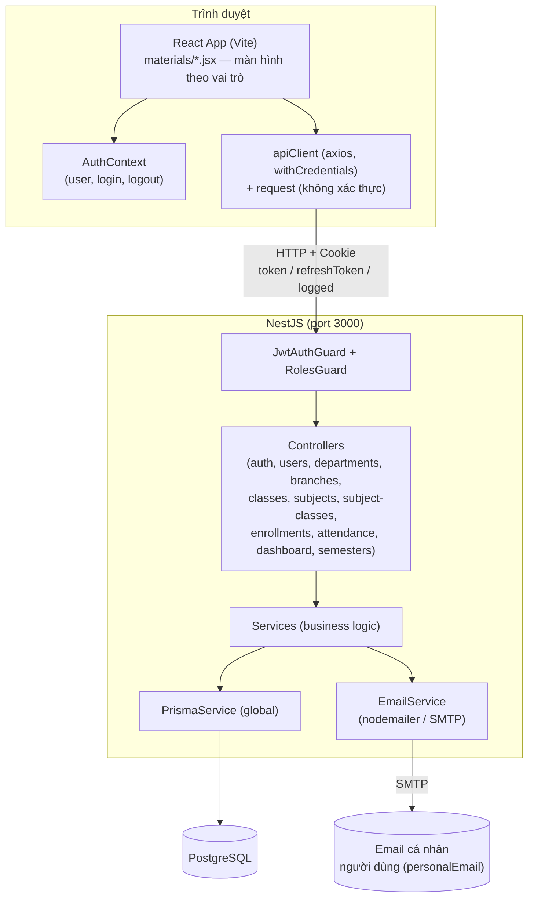

# Kiến Trúc Hệ Thống — Education Management System

> Tài liệu mô tả kiến trúc kỹ thuật của toàn hệ thống quản lý sinh viên trường đại học, gồm hai ứng dụng độc lập `client_side/` (React + Vite) và `server_side/` (NestJS + Prisma + PostgreSQL). Cấu trúc trình bày tham khảo `00-phan-tich-tai-lieu-mau.md`. Nội dung được xác minh trực tiếp trên mã nguồn hiện tại (không dựa vào các tài liệu cũ đã lỗi thời trong cùng thư mục).

## 1. Tổng quan mô hình Client – Server

| | Client | Server |
|---|---|---|
| Vai trò | Giao diện người dùng (SPA), gọi API, hiển thị dữ liệu | Xử lý nghiệp vụ, xác thực, truy vấn CSDL |
| Công nghệ | React 18 + Vite (JavaScript thuần, không TypeScript) | NestJS (TypeScript) + Prisma ORM |
| Giao tiếp | `axios` (`withCredentials: true`) | REST API dưới prefix `/api/...` |
| Cổng | `5173` (dev) | `3000` |
| Xác thực | Cookie `httpOnly` (không lưu token vào JS/localStorage) | JWT RS256 ký bằng cặp khóa RSA **riêng cho từng người dùng** |
| CSDL | — | PostgreSQL, truy cập qua Prisma Client |



## 2. Kiến trúc Server (`server_side/`)

### 2.1 Mẫu kiến trúc

NestJS theo mẫu phân lớp chuẩn: **Controller → Service → PrismaService → PostgreSQL**. Controller chỉ khai báo route + guard, không chứa logic nghiệp vụ; toàn bộ logic (validate, tính điểm, kiểm tra quyền sở hữu…) nằm trong Service.

### 2.2 Danh sách module (`src/`)

| Module | Có Controller? | Chức năng chính |
|---|---|---|
| `auth/` | ✅ (chia sẻ prefix `api/users`) | Đăng nhập, đăng xuất, làm mới token, quên/đặt lại mật khẩu, đổi mật khẩu |
| `users/` | ✅ (`api/users`) | CRUD sinh viên/giảng viên, nhập hàng loạt, cập nhật hồ sơ |
| `departments/` | ✅ (`api/departments`) | CRUD Khoa |
| `branches/` | ✅ (`api/branches`) | CRUD Ngành |
| `classes/` | ✅ (`api/classes`) | CRUD Lớp hành chính |
| `subjects/` | ✅ (`api/subjects`) | CRUD Môn học |
| `subject-classes/` | ✅ (`api/subject-classes`) | CRUD Lớp học phần, danh sách lớp theo vai trò |
| `enrollments/` | ✅ (`api/enrollments`) | Đăng ký/hủy học phần, nhập điểm, khóa điểm, bảng điểm, GPA |
| `attendance/` | ✅ (`api/attendance`) | Điểm danh (đơn lẻ + hàng loạt) |
| `dashboard/` | ✅ (`api/dashboard`) | Thống kê theo vai trò (admin/teacher/student) |
| `semesters/` | ✅ (`api/semesters`) | CRUD học kỳ, đánh dấu học kỳ đang hoạt động |
| `email/` | ❌ (module hạ tầng) | Gửi email thật qua SMTP (nodemailer) |
| `prisma/` | ❌ (module hạ tầng, `@Global()`) | Cung cấp `PrismaService` cho toàn bộ ứng dụng |
| `common/` | ❌ | `JwtAuthGuard`, `RolesGuard`, decorator `@Roles(...)` |
| `constants/` | ❌ | Hằng số xác thực (`auth.constants.ts`), dữ liệu seed |

`app.module.ts` import: `PrismaModule, AuthModule, UsersModule, DepartmentsModule, BranchesModule, ClassesModule, SubjectsModule, SubjectClassesModule, EnrollmentsModule, AttendanceModule, DashboardModule, SemestersModule`. **`EmailModule` không nằm trong danh sách này** — nó chỉ được `AuthModule` và `UsersModule` import riêng lẻ (module cục bộ, dùng nội bộ).

### 2.3 Cơ chế xác thực — JWT RS256 với cặp khóa RSA riêng từng người dùng

Đây **không phải** JWT dùng secret dùng chung. Toàn bộ cơ chế nằm trong `AuthService` (`src/auth/auth.service.ts`), không dùng Passport strategy:

1. **Đăng nhập** (`identifier` = phần trước `@` trong email trường, ví dụ `20216001`, + `password`): xóa toàn bộ `ApiKey` cũ của user → sinh **cặp khóa RSA-2048 mới** → lưu `publicKey`/`privateKey` (PEM) vào bảng `api_keys` → ký access token (15 phút) và refresh token (7 ngày) bằng **private key** vừa tạo.
2. **Xác minh mỗi request** (`JwtAuthGuard`): đọc cookie `token` → decode (chưa verify) lấy `id` user → tra bảng `api_keys` lấy `publicKey` tương ứng → `jwt.verify(token, publicKey)` → gắn `{ id, role }` vào `req.user`. Không có key → 401. User bị khóa (`status` không active) → 403 `ACCOUNT_LOCKED`.
3. **Đăng xuất / đổi mật khẩu / đặt lại mật khẩu**: đều xóa toàn bộ hàng `ApiKey` của user → mọi token đang tồn tại lập tức vô hiệu (không cần blacklist).
4. **Làm mới token** (`GET /api/users/refresh-token`): verify refresh token bằng public key hiện có → ký lại **chỉ access token** mới (refresh token giữ nguyên, không cấp lại).

> Không có endpoint "đăng ký" — tài khoản chỉ được tạo bởi **Admin** qua `users.service.ts` (tạo đơn lẻ hoặc nhập hàng loạt).

### 2.4 Phân quyền (Guards)

| Thành phần | Vị trí | Cơ chế |
|---|---|---|
| `JwtAuthGuard` | `src/auth/jwt-auth.guard.ts` | Đọc cookie `token`, verify, gắn `req.user = { id, role }`. Áp dụng ở **cấp class** hầu hết controller. |
| `RolesGuard` + `@Roles(...)` | `src/common/guards/roles.guard.ts`, `src/common/decorators/roles.decorator.ts` | Đọc metadata roles yêu cầu qua `Reflector`; không khai báo `@Roles` → cho qua; có khai báo mà `req.user.role` không khớp → `403 Forbidden`. Áp dụng ở **cấp handler** cho các route cần giới hạn vai trò (`admin`, `teacher`, `student`). |

### 2.5 Cookie sau đăng nhập

| Cookie | httpOnly | Mục đích |
|---|---|---|
| `token` | ✅ | Access token JWT RS256 (15 phút) |
| `refreshToken` | ✅ | Refresh token JWT RS256 (7 ngày) |
| `logged` | ❌ | Cờ JS đọc được (`'1'`) để client biết trạng thái đăng nhập mà không cần đọc token |

Dev: `secure=false, sameSite=lax`. Production (`NODE_ENV=production`): `secure=true, sameSite=strict`.

### 2.6 Module Email (`src/email/`) — gửi email thật, không còn console.log

`EmailService` bọc `nodemailer` (SMTP qua biến môi trường `SMTP_HOST/PORT/SECURE/USER/PASS`), gửi 2 loại email HTML tiếng Việt (thương hiệu "EduManage"):

| Hàm | Được gọi từ | Khi nào |
|---|---|---|
| `sendAccountCredentials(...)` | `UsersService.createStudent/createTeacher/bulkImportStudents/bulkImportTeachers` | Gửi email trường + mật khẩu tạm về **`personalEmail`** khi Admin tạo tài khoản (đơn lẻ hoặc hàng loạt) |
| `sendOtp(...)` | `AuthService.forgotPassword` | Gửi mã OTP 6 số về `personalEmail` khi quên mật khẩu |

Trường `User.personalEmail` là **bắt buộc** để thực hiện `createStudent`, `createTeacher`, hoặc `forgotPassword` (thiếu → lỗi 400). Nếu gửi thất bại: `sendAccountCredentials` chỉ log cảnh báo (không chặn luồng tạo tài khoản); `sendOtp` sẽ ném lỗi (chặn luồng quên mật khẩu).

### 2.7 Module Semester (Học kỳ) — liên kết bằng chuỗi, không phải khóa ngoại

Model `Semester` (`id, name, isActive`) là bảng tra cứu **độc lập**, **không có quan hệ khóa ngoại** tới `SubjectClass`. `SubjectClass.semester` vẫn là trường `String` tự do (ví dụ `"HK1 2024-2025"`). Việc "lọc theo học kỳ đang hoạt động" được thực hiện bằng cách: lấy danh sách `name` các `Semester` có `isActive = true`, rồi lọc `SubjectClass`/`Enrollment` có `semester ∈ [danh sách tên đó]` — **so khớp chuỗi**, không phải join. Logic này hiện bị lặp lại độc lập ở 3 nơi: `subject-classes.service.ts`, `dashboard.service.ts`, và trực tiếp trong `enrollments.service.ts` (`findMy`).

### 2.8 Ghi chú kỹ thuật quan trọng (đối chiếu với tài liệu cũ)

- **Model `Notification` đã bị loại bỏ hoàn toàn** khỏi schema, `app.module.ts` và toàn bộ mã nguồn — không còn bảng, endpoint, hay UI thông báo nào trong hệ thống hiện tại.
- **`ActivityLog`** vẫn tồn tại trong `schema.prisma` (bảng `activity_logs`) nhưng **không có bất kỳ service nào ghi log vào bảng này** — đây là tính năng đã thiết kế CSDL nhưng chưa được nối logic (kỹ thuật nợ).
- `toggleGradeLock` (khóa/mở khóa điểm) **không kiểm tra quyền sở hữu lớp học phần** — bất kỳ `teacher` hoặc `admin` nào cũng có thể khóa/mở khóa điểm của **bất kỳ** lớp nào, khác với `updateGrade` (chỉ giáo viên phụ trách đúng lớp mới được nhập điểm).
- `bulkMark` điểm danh **không kiểm tra sinh viên có thực sự đăng ký lớp học phần đó hay không** trước khi ghi nhận điểm danh.

## 3. Kiến trúc Client (`client_side/`)

### 3.1 Cấu trúc thư mục thực tế

```
client_side/src/
├── App.jsx / main.jsx / styles.css
├── config/            # axiosClient.js, request.js, userRequest.js
├── constants/         # api.constants.js, auth.constants.js, storage.constants.js
├── context/           # AuthContext.jsx
├── layouts/           # AdminLayout.jsx, TeacherLayout.jsx, StudentLayout.jsx  ⚠️ xem mục 3.3
├── materials/         # TOÀN BỘ màn hình thực tế nằm ở đây (không phải trong pages/)
│   ├── admin.jsx      # Admin: Dashboard, Sinh viên (+ nhập hàng loạt)
│   ├── admin2.jsx      # Admin: Giảng viên, Khoa/Ngành/Lớp/Môn học, Lớp học phần, Học kỳ
│   ├── teacher.jsx     # Giảng viên: Dashboard, Lớp của tôi, Điểm danh, Nhập điểm
│   ├── student.jsx     # Sinh viên: Dashboard, Đăng ký học phần, Bảng điểm/GPA
│   ├── details.jsx     # Hồ sơ chi tiết, lịch học dùng chung
│   ├── ui.jsx          # AppProvider (theme + i18n), component dùng chung, useToast
│   ├── charts.jsx      # Biểu đồ (Bar/Donut/Line)
│   ├── icons.jsx       # Icon SVG
│   ├── tools.jsx       # BulkImportDrawer, parseCSV, downloadCSV
│   ├── auth.jsx        # PwField, PwChecklist tái sử dụng cho login/đổi mật khẩu
│   └── db.js           # CHỈ còn là từ điển i18n (vi/en) — không còn dữ liệu giả
├── pages/
│   ├── login/LoginUser.jsx     # Đăng nhập + quên/đặt lại mật khẩu (OTP)
│   ├── profile/ProfilePage.jsx # Hồ sơ cá nhân + đổi mật khẩu
│   └── admin/, student/, teacher/   # ⚠️ RỖNG (chỉ .gitkeep) — không dùng
└── routes/             # ⚠️ RỖNG (chỉ .gitkeep) — không dùng
```

### 3.2 Định tuyến & gate xác thực

`App.jsx` bọc `AppProvider` (theme/i18n) → `AuthProvider` → render `<LoginUser renderApp={(user, onSignOut) => <Shell .../>} />`. `LoginUser` kiểm tra `useAuth()`: đang tải → spinner; đã có `user` → gọi `renderApp`; chưa có → hiển thị màn hình đăng nhập/quên-đặt lại mật khẩu. Đây **đúng** với mô tả trong `CLAUDE.md` — không có gate kiểu React Router `<Route>`.

`Shell` (định nghĩa ngay trong `App.jsx`) là một **router tự viết bằng `switch` theo state `route`** (ví dụ `'a-dash'`, `'t-grades'`, `'s-reg'`), map sang component tương ứng trong `materials/*.jsx`.

### 3.3 ⚠️ Mã chết cần lưu ý: `layouts/*.jsx`

`layouts/AdminLayout.jsx`, `TeacherLayout.jsx`, `StudentLayout.jsx` là các shell hoàn chỉnh dựa trên `react-router-dom` (`Outlet`, `useNavigate`, `useLocation`), đọc `user` từ `localStorage.getItem('user')` — nhưng **không hề được mount ở bất kỳ đâu**. `App.jsx` chỉ import **named export `NAV`** (mảng cấu hình menu) từ các file này, còn phần component layout thực tế (mặc định export) không được sử dụng. Đây là phần mã còn sót lại từ một thiết kế định tuyến cũ (react-router) đã được thay bằng `Shell` tự viết — cần cân nhắc dọn dẹp, và **không nên dùng làm tài liệu tham khảo cho luồng auth/localStorage thực tế** (thực tế dùng cookie + `AuthContext`, không dùng `localStorage.getItem('user')`).

### 3.4 HTTP Clients

| File | Dùng cho | Đặc điểm |
|---|---|---|
| `config/request.js` | Đăng nhập, làm mới token, quên/xác minh OTP/đặt lại mật khẩu, kiểm tra phiên (`requestAuth`) | Axios thuần, không interceptor |
| `config/axiosClient.js` (`apiClient`) | Tất cả API cần xác thực | `withCredentials: true`; interceptor 401 tự gọi `GET /api/users/refresh-token`, gom các request đồng thời vào hàng đợi, thử lại 1 lần; nếu tài khoản bị khóa (403 `ACCOUNT_LOCKED`) → phát sự kiện `auth:account-locked`, xóa cookie `logged`; refresh thất bại hoặc không có cookie `logged` → điều hướng cứng về `/` |

### 3.5 AuthContext (`context/AuthContext.jsx`)

Cung cấp `{ user, loading, login, logout, lockedMessage, clearLockedMessage }`. `user` được enrich thêm `roleKey` (ánh xạ hoa từ `role` viết thường trong DB). Khi mount: gọi `GET /api/users/auth` để khôi phục phiên; lắng nghe sự kiện `auth:account-locked` (do `axiosClient` phát ra) để hiển thị modal khóa tài khoản.

### 3.6 Nhóm endpoint đang được gọi từ `userRequest.js` (đối chiếu `api.constants.js`)

| Nhóm | Ví dụ hàm | Ghi chú |
|---|---|---|
| Xác thực | `requestLogin, requestAuth, requestLogout, requestRefreshToken, requestForgotPassword, requestVerifyOtp, requestResetPassword, requestChangePassword` | |
| Dashboard | `requestDashboard, requestTeacherDashboard, requestStudentDashboard` | 3 endpoint riêng theo vai trò |
| Người dùng | `requestStudents, requestCreateStudent, requestNextStudentId, requestBulkImport, requestTeachers, requestCreateTeacher, requestNextTeacherId, requestBulkImportTeachers, requestUser, requestUpdateUser, requestToggleUserStatus, requestDeleteUser` | |
| Danh mục | `requestDepartments/Branches/Classes/Subjects` (+ Create/Update/Delete cho từng loại) | |
| Lớp học phần | `requestSubjectClasses` (+ CRUD), `requestMySections`, `requestSectionRoster` | |
| Điểm danh | `requestAttendance, requestMyAttendance, requestBulkAttendance, requestUpdateAttendance` | |
| Điểm số | `requestGradeSheet, requestUpdateGrade, requestToggleGradeLock` | |
| Đăng ký học phần | `requestMyEnrollments, requestTranscript, requestGpaTrend, requestRegister, requestDropEnrollment` | |
| Học kỳ | `requestSemesters, requestActiveSemesters, requestCreateSemester, requestUpdateSemester, requestToggleSemesterActive, requestDeleteSemester` | Màn hình `SemestersScreen` trong `admin2.jsx` |

**Không tồn tại endpoint thông báo (notification) nào** ở client — nhất quán với việc model `Notification` đã bị gỡ bỏ ở server.

### 3.7 Theme & Đa ngôn ngữ

Cả theme (sáng/tối) và ngôn ngữ (`vi`/`en`) đều là tùy chọn **hoàn toàn phía client**, lưu trong `localStorage` (`em_theme`, `em_lang`), không có endpoint backend nào liên quan. Theme áp dụng qua thuộc tính `data-theme` trên `<html>` + CSS custom properties (`styles.css`). i18n tra cứu qua `DB.I18N[lang][key]` (nay `db.js` chỉ còn từ điển này, không còn dữ liệu giả — đã được thay hoàn toàn bằng API thật ở mọi màn hình).

### 3.8 Quy tắc mật khẩu (`constants/auth.constants.js` → `PW_RULES`)

Tối thiểu 8 ký tự · có chữ hoa · có chữ số · có ký tự đặc biệt. Áp dụng ở màn hình đặt lại mật khẩu (`LoginUser.jsx`) và đổi mật khẩu (`ProfilePage.jsx`).

### 3.9 Nhập hàng loạt (`materials/tools.jsx`)

`BulkImportDrawer` chấp nhận `.csv`, `.xlsx`, `.xls` (Excel được parse qua thư viện `xlsx`, lazy-import). Luồng: kéo-thả/dán CSV → validate từng dòng phía client → xác nhận → gọi `POST /api/users/bulk-import` (sinh viên, kèm `personalEmail` từng dòng) hoặc `POST /api/users/bulk-import-teachers` (giảng viên).

## 4. Luồng dữ liệu tổng quát

```
Người dùng thao tác UI (materials/*.jsx)
  → gọi hàm trong config/userRequest.js
    → apiClient (đã xác thực) hoặc request (chưa xác thực)
      → HTTP + cookie → NestJS
        → JwtAuthGuard (xác thực) → RolesGuard (phân quyền, nếu có @Roles)
          → Controller → Service (nghiệp vụ) → PrismaService → PostgreSQL
        ← chuẩn response { success, message, metadata } hoặc NestJS HttpException
      ← JSON
    ← cập nhật state React → re-render UI
```
