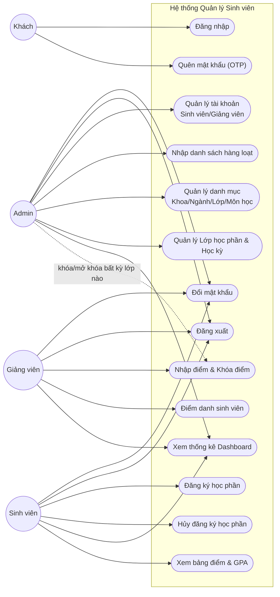

# Đặc Tả Nghiệp Vụ (Use Case) — Education Management System

> Khuôn mẫu đặc tả theo `00-phan-tich-tai-lieu-mau.md` (mục 3.3). Nội dung nghiệp vụ lấy từ mã nguồn thực tế của `server_side/` (service layer) và `client_side/` (màn hình thao tác), không phải suy diễn.

## 1. Danh sách tác nhân (Actor)

| STT | Tác nhân | Mô tả |
|---|---|---|
| 1 | **Khách (chưa đăng nhập)** | Người truy cập ứng dụng nhưng chưa xác thực. Chỉ có thể đăng nhập, hoặc thực hiện quên/đặt lại mật khẩu. |
| 2 | **Admin** | Toàn quyền quản trị: tài khoản (Sinh viên/Giảng viên), danh mục (Khoa, Ngành, Lớp, Môn học, Lớp học phần, Học kỳ), xem thống kê toàn hệ thống. Không trực tiếp nhập điểm/điểm danh nhưng có quyền khóa/mở khóa điểm và xem toàn bộ lớp học phần. |
| 3 | **Giảng viên (Teacher)** | Xem các lớp học phần mình phụ trách, điểm danh sinh viên, nhập/sửa điểm (khi chưa khóa), khóa/mở khóa điểm, xem thống kê lớp mình dạy. |
| 4 | **Sinh viên (Student)** | Đăng ký/hủy đăng ký học phần, xem điểm danh của bản thân, xem bảng điểm & GPA, xem thống kê cá nhân. |

Cả 3 vai trò đã đăng nhập đều dùng chung: đăng xuất, đổi mật khẩu, cập nhật hồ sơ cá nhân.

## 2. Biểu đồ Use Case tổng quát

## 3. Đặc tả chi tiết Use Case

### UC#01: Đăng nhập

| | |
|---|---|
| **Độ phức tạp** | Cao |
| **Mô tả** | Cho phép người dùng (Admin/Giảng viên/Sinh viên) đăng nhập bằng định danh + mật khẩu để sử dụng hệ thống. |
| **Tác nhân** | Khách |
| **Tiền điều kiện** | Tài khoản đã được Admin tạo trước đó (hệ thống không có chức năng tự đăng ký). |
| **Hậu điều kiện — Thành công** | 3 cookie được thiết lập (`token`, `refreshToken`, `logged`); người dùng được điều hướng vào giao diện theo vai trò (`role`). |
| **Hậu điều kiện — Lỗi** | Không đăng nhập được; không có cookie nào được thiết lập. |

**Luồng sự kiện chính**
1. Người dùng nhập **định danh** (phần trước `@` trong email trường, VD mã sinh viên `20216001`) và **mật khẩu**.
2. Hệ thống kiểm tra đã nhập đủ 2 trường bắt buộc — thiếu thì thực hiện Luồng A.
3. Server tìm `User` có email khớp `identifier + '@...'`, so khớp `password` bằng bcrypt.
4. Nếu hợp lệ: xóa toàn bộ `ApiKey` cũ của user → sinh cặp khóa RSA-2048 mới → ký access token (15 phút) + refresh token (7 ngày) bằng private key vừa tạo → set 3 cookie → trả về thông tin `user`.
5. Nếu tài khoản có `status` không active (VD `inactive`, `resigned`...) → thực hiện Luồng B.
6. Nếu sai định danh/mật khẩu → thực hiện Luồng C.
7. Client lưu `user` vào `AuthContext`, điều hướng theo `role`.

**Luồng sự kiện phát sinh**
- **Luồng A** — Thiếu trường bắt buộc: hiển thị lỗi inline tương ứng ("Vui lòng nhập tài khoản/mật khẩu").
- **Luồng B** — Tài khoản bị khóa: trả lỗi `403 ACCOUNT_LOCKED`; client hiển thị modal thông báo tài khoản đã bị khóa.
- **Luồng C** — Sai thông tin: trả lỗi xác thực; client hiển thị "Tài khoản hoặc mật khẩu không chính xác".

---

### UC#02: Quên mật khẩu (xác thực qua OTP)

| | |
|---|---|
| **Độ phức tạp** | Cao |
| **Mô tả** | Cho phép người dùng đặt lại mật khẩu khi quên, thông qua mã OTP gửi tới **email cá nhân** (`personalEmail`). |
| **Tác nhân** | Khách |
| **Tiền điều kiện** | Tài khoản đã có `personalEmail` được Admin thiết lập khi tạo tài khoản. |
| **Hậu điều kiện — Thành công** | Mật khẩu mới được lưu (bcrypt hash); toàn bộ `ApiKey` của user bị xóa (đăng xuất khỏi mọi phiên đang mở). |
| **Hậu điều kiện — Lỗi** | Mật khẩu không đổi; OTP không hợp lệ hoặc hết hạn. |

**Luồng sự kiện chính**
1. Người dùng nhập định danh tài khoản, chọn "Quên mật khẩu".
2. `POST /api/users/forgot-password`: hệ thống tìm user; nếu `personalEmail` rỗng → Luồng A. Ngược lại sinh OTP 6 số, bcrypt-hash, lưu bảng `otps` (xóa OTP cũ trước đó của user, hiệu lực **5 phút**), gửi email OTP tới `personalEmail` qua `EmailService.sendOtp`.
3. Người dùng nhập mã OTP nhận được → `POST /api/users/verify-otp` xác thực (bcrypt compare) trước khi cho nhập mật khẩu mới (trải nghiệm 2 bước trên UI).
4. Người dùng nhập mật khẩu mới (phải thỏa `PW_RULES`: ≥8 ký tự, có hoa, có số, có ký tự đặc biệt) → `POST /api/users/reset-password` với `{identifier, otp, newPassword}`.
5. Server xác thực lại OTP, cập nhật mật khẩu, xóa toàn bộ bản ghi `Otp` và `ApiKey` của user.

**Luồng sự kiện phát sinh**
- **Luồng A** — Không có `personalEmail`: trả lỗi 400, không gửi được OTP; người dùng phải liên hệ Admin cập nhật email cá nhân.
- **Luồng B** — OTP sai/hết hạn: hiển thị lỗi, cho phép gửi lại OTP.
- **Luồng C** — Mật khẩu mới không thỏa quy tắc: hiển thị checklist các điều kiện chưa đạt (`PwChecklist`).
- **Luồng D** — Gửi email SMTP thất bại: server ném lỗi 500, luồng quên mật khẩu bị chặn (khác với luồng gửi thông tin tài khoản, luồng OTP **không** có fallback im lặng).

---

### UC#03: Đổi mật khẩu

| | |
|---|---|
| **Độ phức tạp** | Trung bình |
| **Mô tả** | Người dùng đã đăng nhập tự đổi mật khẩu của chính mình. |
| **Tác nhân** | Admin, Giảng viên, Sinh viên |
| **Tiền điều kiện** | Đã đăng nhập. |
| **Hậu điều kiện — Thành công** | Mật khẩu cập nhật; toàn bộ `ApiKey` bị xóa → buộc đăng nhập lại ở mọi thiết bị. |
| **Hậu điều kiện — Lỗi** | Mật khẩu không đổi. |

**Luồng sự kiện chính**
1. Người dùng vào trang Hồ sơ cá nhân (`ProfilePage.jsx`), nhập mật khẩu hiện tại + mật khẩu mới + xác nhận.
2. `PUT /api/users/change-password`: server bcrypt-compare mật khẩu hiện tại.
3. Nếu đúng và mật khẩu mới thỏa `PW_RULES` → hash mật khẩu mới, xóa `ApiKey` của user.
4. Client nhận phản hồi thành công, buộc người dùng đăng nhập lại (do cookie hiện tại bị vô hiệu).

**Luồng sự kiện phát sinh**
- **Luồng A** — Mật khẩu hiện tại sai: hiển thị lỗi, không cho phép tiếp tục.
- **Luồng B** — Mật khẩu mới không đạt yêu cầu: hiển thị checklist lỗi tương ứng.

---

### UC#04: Đăng xuất

| | |
|---|---|
| **Độ phức tạp** | Thấp |
| **Mô tả** | Kết thúc phiên làm việc hiện tại. |
| **Tác nhân** | Admin, Giảng viên, Sinh viên |
| **Tiền điều kiện** | Đã đăng nhập. |
| **Hậu điều kiện — Thành công** | `ApiKey` bị xóa khỏi DB; 3 cookie bị xóa khỏi trình duyệt; điều hướng về màn hình đăng nhập. |

**Luồng sự kiện chính**
1. Người dùng chọn "Đăng xuất" trên menu tài khoản.
2. `POST /api/users/logout` (yêu cầu `JwtAuthGuard`): server xóa toàn bộ `ApiKey` của user, xóa 3 cookie.
3. Client xóa `user` khỏi `AuthContext`, quay về màn hình đăng nhập.

*(Không có luồng phát sinh — thao tác không có điều kiện lỗi nghiệp vụ.)*

---

### UC#05: Admin tạo tài khoản Sinh viên / Giảng viên

| | |
|---|---|
| **Độ phức tạp** | Cao |
| **Mô tả** | Admin tạo tài khoản mới; hệ thống tự sinh mã định danh, email trường, mật khẩu tạm, và gửi thông tin đăng nhập tới email cá nhân. |
| **Tác nhân** | Admin |
| **Tiền điều kiện** | Đã đăng nhập với vai trò `admin`. |
| **Hậu điều kiện — Thành công** | Tài khoản mới được tạo với `status` mặc định (`studying` cho sinh viên / `teaching` cho giảng viên); email chứa email trường + mật khẩu tạm được gửi tới `personalEmail`. |
| **Hậu điều kiện — Lỗi** | Không tạo được tài khoản (thiếu `personalEmail`, hoặc trùng mã định danh do race condition). |

**Luồng sự kiện chính**
1. Admin mở màn hình "Sinh viên" (hoặc "Giảng viên"), chọn "Thêm mới".
2. Nhập thông tin (họ tên, giới tính, ngày sinh, lớp/khoa, **email cá nhân bắt buộc**...).
3. `POST /api/users/students` (hoặc `/teachers`): server gọi `getNextStudentId()`/`getNextTeacherId()` sinh mã tự động (`SV{năm}{4 số}` hoặc `GV{năm}{3 số}`, dựa trên số lớn nhất hiện có trong năm đó +1).
4. Server sinh email trường (`{idStudent}@student.school.edu.vn` hoặc `{idTeacher}@teacher.school.edu.vn`), sinh mật khẩu tạm ngẫu nhiên 10 ký tự, bcrypt-hash, tạo `User`.
5. Gọi `EmailService.sendAccountCredentials(...)` gửi email trường + mật khẩu tạm tới `personalEmail`.
6. Nếu thiếu `personalEmail` → thực hiện Luồng A trước khi tạo (chặn ngay từ đầu, trả 400).
7. Nếu trùng mã do có request đồng thời → thực hiện Luồng B.

**Luồng sự kiện phát sinh**
- **Luồng A** — Thiếu `personalEmail`: hệ thống từ chối tạo tài khoản, yêu cầu nhập.
- **Luồng B** — Trùng mã sinh viên/giảng viên do đồng thời tạo: server phát hiện khi kiểm tra lại, trả lỗi 409, Admin thử lại.
- **Luồng C** — Gửi email thất bại (SMTP lỗi): tài khoản **vẫn được tạo thành công**, hệ thống chỉ ghi log cảnh báo (không rollback) — Admin cần cung cấp mật khẩu thủ công nếu email không tới nơi.

---

### UC#06: Nhập danh sách hàng loạt (Bulk Import)

| | |
|---|---|
| **Độ phức tạp** | Cao |
| **Mô tả** | Admin nhập nhiều Sinh viên/Giảng viên cùng lúc từ file CSV/Excel. |
| **Tác nhân** | Admin |
| **Tiền điều kiện** | Có file CSV/XLSX theo đúng mẫu cột yêu cầu. |
| **Hậu điều kiện — Thành công** | Toàn bộ tài khoản hợp lệ được tạo trong **1 transaction** (tất cả hoặc không có gì); email thông tin đăng nhập được gửi (không đồng bộ, không ảnh hưởng kết quả tạo). |
| **Hậu điều kiện — Lỗi** | Không tài khoản nào được tạo nếu có bất kỳ dòng dữ liệu không hợp lệ. |

**Luồng sự kiện chính**
1. Admin tải lên file `.csv`/`.xlsx`/`.xls` (Excel được parse phía client bằng thư viện `xlsx`), hoặc dán trực tiếp CSV.
2. Client parse & validate sơ bộ từng dòng (họ tên, `personalEmail` hợp lệ, lớp tồn tại...), hiển thị preview dòng hợp lệ/lỗi.
3. Admin xác nhận → `POST /api/users/bulk-import` (sinh viên) hoặc `/bulk-import-teachers` (giảng viên) với toàn bộ `rows`.
4. Server validate lại **toàn bộ** danh sách — nếu có bất kỳ dòng lỗi (`fullName` rỗng, `personalEmail` sai định dạng) → từ chối toàn bộ (Luồng A), không tạo dòng nào.
5. Nếu tất cả hợp lệ: sinh N mã định danh tuần tự, tính trước email trường + mật khẩu tạm cho từng dòng, **insert toàn bộ trong 1 `prisma.$transaction`** (đảm bảo tính nguyên tử — tạo hết hoặc không tạo gì).
6. Sau khi transaction thành công: gửi email cho từng user mới theo kiểu **fire-and-forget** (`Promise.allSettled`, không chờ, không ảnh hưởng response) — một vài email gửi lỗi không làm rollback dữ liệu đã tạo.

**Luồng sự kiện phát sinh**
- **Luồng A** — Có dòng dữ liệu không hợp lệ: server trả về danh sách lỗi theo từng dòng, **không tạo bất kỳ tài khoản nào** (all-or-nothing ở bước validate).
- **Luồng B** — Một số email gửi thất bại sau khi đã tạo tài khoản thành công: không có cơ chế thông báo lại cho Admin biết dòng nào gửi lỗi (hạn chế hiện tại).

---

### UC#07: Quản lý danh mục (Khoa / Ngành / Lớp / Môn học)

| | |
|---|---|
| **Độ phức tạp** | Trung bình |
| **Mô tả** | CRUD các danh mục nền tảng: Khoa (`Department`), Ngành (`Branch`), Lớp hành chính (`Class`), Môn học (`Subject`). |
| **Tác nhân** | Admin |
| **Tiền điều kiện** | Đã đăng nhập vai trò `admin`. |
| **Hậu điều kiện — Thành công** | Danh mục được thêm/sửa/xóa; các màn hình khác (tạo lớp học phần, tạo tài khoản...) dùng dữ liệu mới ngay lập tức. |
| **Hậu điều kiện — Lỗi** | Không lưu được (trùng mã, hoặc còn ràng buộc khóa ngoại khi xóa). |

**Luồng sự kiện chính**
1. Admin vào từng màn hình danh mục tương ứng (`admin2.jsx`), xem danh sách (`GET`, mở cho mọi vai trò đã đăng nhập).
2. Thêm mới/sửa: nhập mã + tên (+ `departmentId` nếu là Ngành/Lớp/Môn học) → `POST`/`PUT` (yêu cầu vai trò `admin`).
3. Xóa: `DELETE` (yêu cầu vai trò `admin`) — nếu còn dữ liệu con tham chiếu tới (VD Khoa còn Ngành/Lớp/Môn học) → Luồng A.

**Luồng sự kiện phát sinh**
- **Luồng A** — Xóa khi còn ràng buộc khóa ngoại: PostgreSQL từ chối, server trả lỗi, Admin phải xóa/di chuyển dữ liệu con trước.
- **Luồng B** — Trùng mã (`code`) khi tạo/sửa: vi phạm ràng buộc `unique`, trả lỗi 409/400.

---

### UC#07b: Quản lý Lớp học phần & Học kỳ

| | |
|---|---|
| **Độ phức tạp** | Cao |
| **Mô tả** | Admin tạo Lớp học phần (gắn Môn học + Giảng viên + tên học kỳ dạng chuỗi) và quản lý danh sách Học kỳ (`Semester`), đánh dấu học kỳ nào đang hoạt động. |
| **Tác nhân** | Admin |
| **Tiền điều kiện** | Đã có Môn học và Giảng viên trong hệ thống. |
| **Hậu điều kiện — Thành công** | Lớp học phần mới sẵn sàng cho Sinh viên đăng ký (nếu `status = active` và tên học kỳ trùng với một `Semester.isActive = true`). |

**Luồng sự kiện chính**
1. Admin vào màn hình "Học kỳ" (`SemestersScreen`), tạo học kỳ mới (`POST /api/semesters`) hoặc bật/tắt `isActive` (`PATCH /:id/toggle-active`).
2. Admin vào màn hình "Lớp học phần", tạo mới: chọn Môn học, Giảng viên, **gõ tên học kỳ dạng chuỗi** (không chọn từ danh sách `Semester` — hai nơi này độc lập), sĩ số tối đa, trạng thái.
3. Hệ thống các module khác (đăng ký học phần, dashboard) sẽ tự lọc theo `SubjectClass.semester` có tên khớp với `Semester` đang `isActive = true`.

**Luồng sự kiện phát sinh**
- **Luồng A** — Admin gõ sai/khác chính tả tên học kỳ so với tên trong bảng `Semester`: lớp học phần đó sẽ **không xuất hiện** trong các bộ lọc "học kỳ hiện hành" dù `status = active`, do so khớp chuỗi thất bại (rủi ro dữ liệu — xem `02-co-so-du-lieu.md` mục 4).

---

### UC#08: Sinh viên đăng ký học phần

| | |
|---|---|
| **Độ phức tạp** | Cao |
| **Mô tả** | Sinh viên xem danh sách lớp học phần khả dụng và đăng ký. |
| **Tác nhân** | Sinh viên |
| **Tiền điều kiện** | Đã đăng nhập vai trò `student`. |
| **Hậu điều kiện — Thành công** | Bản ghi `Enrollment` mới với `status = registered`. |
| **Hậu điều kiện — Lỗi** | Không đăng ký được (lớp đầy, đã đăng ký, lớp không mở). |

**Luồng sự kiện chính**
1. Sinh viên vào màn hình "Đăng ký học phần", xem danh sách lớp học phần (`GET /api/subject-classes` — với vai trò student chỉ trả về lớp `status = active` và thuộc học kỳ đang hoạt động).
2. Chọn 1 lớp học phần, nhấn "Đăng ký" → `POST /api/enrollments { subjectClassId }`.
3. Server kiểm tra: lớp tồn tại và `status === active` (ngược lại → Luồng A); số lượng đã đăng ký `< maxStudents` (ngược lại → Luồng B); sinh viên chưa đăng ký lớp này trước đó (ràng buộc `unique studentId+subjectClassId`, ngược lại → Luồng C).
4. Tạo `Enrollment` mới với `status = registered`.

**Luồng sự kiện phát sinh**
- **Luồng A** — Lớp học phần không còn mở (`status ≠ active`): trả lỗi, không cho đăng ký.
- **Luồng B** — Lớp đã đủ sĩ số (`enrolledCount ≥ maxStudents`): trả lỗi "Lớp học phần đã đầy".
- **Luồng C** — Đã đăng ký trước đó: trả lỗi trùng đăng ký.

---

### UC#09: Sinh viên hủy đăng ký học phần

| | |
|---|---|
| **Độ phức tạp** | Trung bình |
| **Mô tả** | Sinh viên hủy một đăng ký đang ở trạng thái `registered`. |
| **Tác nhân** | Sinh viên |
| **Tiền điều kiện** | Đã đăng ký lớp học phần đó; điểm chưa bị khóa (`gradeLocked = false`). |
| **Hậu điều kiện — Thành công** | Bản ghi `Enrollment` bị xóa hẳn khỏi hệ thống. |
| **Hậu điều kiện — Lỗi** | Không hủy được (không sở hữu đăng ký, hoặc điểm đã khóa). |

**Luồng sự kiện chính**
1. Sinh viên chọn "Hủy đăng ký" trên môn đã đăng ký → `DELETE /api/enrollments/:id`.
2. Server kiểm tra `enrollment.studentId === request.user.id` (ngược lại → Luồng A), và `gradeLocked === false` (ngược lại → Luồng B).
3. Xóa bản ghi `Enrollment`.

**Luồng sự kiện phát sinh**
- **Luồng A** — Không phải chủ sở hữu đăng ký: trả `403 Forbidden`.
- **Luồng B** — Điểm đã bị khóa (`gradeLocked = true`): trả lỗi, không cho hủy.

---

### UC#10: Giảng viên nhập điểm & khóa điểm

| | |
|---|---|
| **Độ phức tạp** | Cao |
| **Mô tả** | Giảng viên nhập điểm chuyên cần/giữa kỳ/cuối kỳ cho từng sinh viên trong lớp phụ trách; sau khi hoàn tất, khóa điểm để tránh chỉnh sửa. |
| **Tác nhân** | Giảng viên (nhập điểm); Giảng viên hoặc Admin (khóa/mở khóa) |
| **Tiền điều kiện** | Lớp học phần thuộc quyền phụ trách của giảng viên (chỉ áp dụng cho thao tác **nhập điểm**). |
| **Hậu điều kiện — Thành công** | `totalScore`/`letterGrade` được tự tính lại; `status` chuyển thành `completed`; điểm có thể bị khóa để chống sửa tiếp. |
| **Hậu điều kiện — Lỗi** | Không cập nhật được điểm (không đúng giáo viên phụ trách, hoặc điểm đã khóa). |

**Luồng sự kiện chính**
1. Giảng viên vào "Nhập điểm", chọn lớp học phần mình phụ trách (`GET /api/enrollments/:subjectClassId/grades`).
2. Nhập/sửa điểm chuyên cần, giữa kỳ, cuối kỳ cho từng sinh viên → `PUT /api/enrollments/:id/grade`.
3. Server kiểm tra `subjectClass.teacherId === request.user.id` (ngược lại → Luồng A) và `gradeLocked === false` (ngược lại → Luồng B).
4. Server gộp điểm mới với điểm cũ (giá trị chưa nhập giữ nguyên/mặc định 0), tính `totalScore = round((CC×0.1 + GK×0.3 + CK×0.6)×10)/10`, suy ra `letterGrade` theo ngưỡng, đặt `status = completed`.
5. Sau khi nhập xong toàn bộ lớp, Giảng viên hoặc Admin chọn "Khóa điểm" → `PATCH /api/enrollments/:id/lock { locked: true }` cho từng sinh viên/hoặc theo lớp.

**Luồng sự kiện phát sinh**
- **Luồng A** — Giảng viên không phụ trách lớp này: trả `403 Forbidden` khi nhập điểm.
- **Luồng B** — Điểm đã bị khóa: từ chối cập nhật.
- **Luồng C** *(lưu ý thiết kế)* — Thao tác khóa/mở khóa **không kiểm tra quyền sở hữu lớp** — bất kỳ tài khoản `teacher` hoặc `admin` nào cũng gọi được `PATCH /:id/lock` cho bất kỳ enrollment nào, khác với logic chặt hơn ở bước nhập điểm.

---

### UC#11: Giảng viên điểm danh sinh viên

| | |
|---|---|
| **Độ phức tạp** | Cao |
| **Mô tả** | Giảng viên điểm danh cả lớp theo buổi học (ngày cụ thể), có thể điểm danh lại (upsert) mà không tạo trùng bản ghi. |
| **Tác nhân** | Giảng viên |
| **Tiền điều kiện** | Lớp học phần thuộc quyền phụ trách của giảng viên. |
| **Hậu điều kiện — Thành công** | Mỗi sinh viên trong danh sách có đúng 1 bản ghi `Attendance` cho ngày đó (tạo mới hoặc cập nhật). |
| **Hậu điều kiện — Lỗi** | Điểm danh thất bại toàn bộ hoặc một phần. |

**Luồng sự kiện chính**
1. Giảng viên chọn lớp học phần + ngày điểm danh.
2. Đánh dấu trạng thái từng sinh viên (`present`/`absent`/`late`/`excused`) + ghi chú (tùy chọn).
3. `POST /api/attendance/bulk { subjectClassId, date, records: [...] }`.
4. Server kiểm tra `subjectClass.teacherId === request.user.id` (ngược lại → Luồng A).
5. Với từng sinh viên, thực hiện `upsert` theo khóa duy nhất `(subjectClassId, studentId, date)` — đã có bản ghi thì cập nhật, chưa có thì tạo mới. Thực hiện đồng thời (`Promise.allSettled`), trả về số lượng thành công/thất bại — **một dòng lỗi không làm hỏng toàn bộ yêu cầu**.
6. Giảng viên có thể sửa lại một bản ghi điểm danh đơn lẻ qua `PUT /api/attendance/:id`.

**Luồng sự kiện phát sinh**
- **Luồng A** — Giảng viên không phụ trách lớp: trả `403 Forbidden`, không điểm danh được dòng nào.
- **Luồng B** *(lưu ý thiết kế)* — Hệ thống **không kiểm tra sinh viên có thực sự đăng ký (`Enrollment`) lớp học phần đó hay không** trước khi ghi nhận điểm danh — có thể điểm danh cho một sinh viên chưa đăng ký nếu client gửi sai `studentId`.

---

### UC#12: Xem thống kê Dashboard (theo vai trò)

| | |
|---|---|
| **Độ phức tạp** | Trung bình |
| **Mô tả** | Mỗi vai trò xem một bộ thống kê khác nhau ngay khi đăng nhập. |
| **Tác nhân** | Admin, Giảng viên, Sinh viên |
| **Tiền điều kiện** | Đã đăng nhập. |
| **Hậu điều kiện — Thành công** | Hiển thị đúng bộ số liệu theo vai trò. |

**Luồng sự kiện chính**
1. **Admin** (`GET /api/dashboard`): tổng số sinh viên/giảng viên/lớp học phần/môn học/khoa, số lớp `active`, phân bố giới tính, phân bố điểm chữ (A–F, toàn hệ thống, không lọc theo học kỳ), số đăng ký mới trong 7 ngày qua.
2. **Giảng viên** (`GET /api/dashboard/teacher`): số lớp phụ trách (lọc học kỳ hiện hành), tổng sinh viên, tỷ lệ điểm danh (%), số bài chưa chấm điểm (`totalScore = null`), biểu đồ xu hướng điểm danh 8 buổi gần nhất.
3. **Sinh viên** (`GET /api/dashboard/student`): số tín chỉ đang học (học kỳ hiện hành), GPA hiện tại (công thức trọng số theo tín chỉ), tỷ lệ điểm danh cá nhân, xu hướng GPA theo từng học kỳ.

*(Không có luồng phát sinh — thao tác chỉ đọc dữ liệu.)*

---

### UC#13: Sinh viên xem bảng điểm & GPA

| | |
|---|---|
| **Độ phức tạp** | Trung bình |
| **Mô tả** | Sinh viên xem bảng điểm tích lũy toàn khóa và GPA. |
| **Tác nhân** | Sinh viên |
| **Tiền điều kiện** | Có ít nhất một `Enrollment` ở trạng thái `completed`. |
| **Hậu điều kiện — Thành công** | Hiển thị đầy đủ điểm từng môn + GPA tổng + xu hướng GPA theo học kỳ. |

**Luồng sự kiện chính**
1. Sinh viên vào "Bảng điểm" → `GET /api/enrollments/transcript`: trả toàn bộ `Enrollment` có `status = completed`, cùng `gpa = round(Σ(totalScore×credits) / Σ(credits), 2)` và `totalCredits`.
2. Xem biểu đồ xu hướng: `GET /api/enrollments/gpa-trend` — nhóm điểm theo `subjectClass.semester` (chuỗi), tính GPA riêng từng học kỳ, sắp xếp theo tên học kỳ.

*(Không có luồng phát sinh — thao tác chỉ đọc dữ liệu; nếu chưa có môn nào `completed` thì hiển thị bảng trống/GPA rỗng.)*
