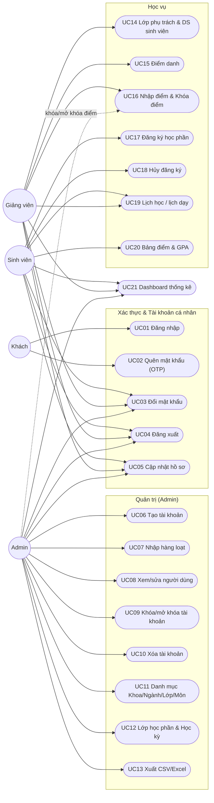

# Đặc Tả Nghiệp Vụ (Use Case) — Education Management System

> Khuôn mẫu đặc tả theo `00-phan-tich-tai-lieu-mau.md` (mục 3.3). Nội dung nghiệp vụ lấy từ mã nguồn thực tế của `server_side/` (service layer) và `client_side/` (màn hình thao tác), không phải suy diễn. Phiên bản này (v2) mở rộng từ 14 lên **21 use case**, bổ sung các nghiệp vụ đã có trong source nhưng chưa được tài liệu hóa: cập nhật hồ sơ, khóa/mở khóa & xóa tài khoản, xem chi tiết người dùng, xuất danh sách, xem lớp phụ trách, xem lịch học/lịch dạy.

## 1. Danh sách tác nhân (Actor)

| STT | Tác nhân | Mô tả |
|---|---|---|
| 1 | **Khách (chưa đăng nhập)** | Người truy cập ứng dụng nhưng chưa xác thực. Chỉ có thể đăng nhập, hoặc thực hiện quên/đặt lại mật khẩu. |
| 2 | **Admin** | Toàn quyền quản trị: tài khoản (Sinh viên/Giảng viên — tạo, sửa, khóa/mở khóa, xóa), danh mục (Khoa, Ngành, Lớp, Môn học, Lớp học phần, Học kỳ), xuất danh sách, xem thống kê toàn hệ thống. Không trực tiếp nhập điểm/điểm danh nhưng có quyền khóa/mở khóa điểm và xem toàn bộ lớp học phần. |
| 3 | **Giảng viên (Teacher)** | Xem các lớp học phần mình phụ trách và danh sách sinh viên, điểm danh, nhập/sửa điểm (khi chưa khóa), khóa/mở khóa điểm, xem lịch dạy, xem thống kê lớp mình dạy. |
| 4 | **Sinh viên (Student)** | Đăng ký/hủy đăng ký học phần, xem môn đã đăng ký & lịch học, xem bảng điểm & GPA, xem thống kê cá nhân. |

Cả 3 vai trò đã đăng nhập đều dùng chung: đăng xuất, đổi mật khẩu, cập nhật hồ sơ cá nhân.

## 2. Danh mục Use Case

| Mã | Tên Use Case | Tác nhân | Nhóm |
|---|---|---|---|
| UC#01 | Đăng nhập | Khách | Xác thực |
| UC#02 | Quên mật khẩu (OTP qua email) | Khách | Xác thực |
| UC#03 | Đổi mật khẩu | Mọi vai trò | Xác thực |
| UC#04 | Đăng xuất | Mọi vai trò | Xác thực |
| UC#05 | Cập nhật hồ sơ cá nhân | Mọi vai trò | Tài khoản |
| UC#06 | Tạo tài khoản Sinh viên / Giảng viên | Admin | Tài khoản |
| UC#07 | Nhập danh sách hàng loạt (Bulk Import) | Admin | Tài khoản |
| UC#08 | Xem chi tiết & cập nhật thông tin người dùng | Admin | Tài khoản |
| UC#09 | Khóa / mở khóa tài khoản | Admin | Tài khoản |
| UC#10 | Xóa tài khoản | Admin | Tài khoản |
| UC#11 | Quản lý danh mục (Khoa / Ngành / Lớp / Môn học) | Admin | Danh mục |
| UC#12 | Quản lý Lớp học phần & Học kỳ | Admin | Danh mục |
| UC#13 | Xuất danh sách (CSV / Excel) | Admin | Danh mục |
| UC#14 | Xem lớp phụ trách & danh sách sinh viên | Giảng viên | Học vụ |
| UC#15 | Điểm danh sinh viên | Giảng viên | Học vụ |
| UC#16 | Nhập điểm & Khóa điểm | Giảng viên (+ Admin khóa) | Học vụ |
| UC#17 | Đăng ký học phần | Sinh viên | Học vụ |
| UC#18 | Hủy đăng ký học phần | Sinh viên | Học vụ |
| UC#19 | Xem môn đã đăng ký & lịch học / lịch dạy | Sinh viên, Giảng viên | Học vụ |
| UC#20 | Xem bảng điểm & GPA | Sinh viên | Học vụ |
| UC#21 | Xem thống kê Dashboard | Mọi vai trò | Thống kê |

## 3. Biểu đồ Use Case tổng quát

## 4. Đặc tả chi tiết Use Case

### UC#01: Đăng nhập

| | |
|---|---|
| **Độ phức tạp** | Cao |
| **Mô tả** | Người dùng đăng nhập bằng mã định danh + mật khẩu; hệ thống tự xác định vai trò (Admin / Giảng viên / Sinh viên) từ tài khoản. |
| **Tác nhân** | Khách |
| **Tiền điều kiện** | Tài khoản đã được Admin tạo trước đó (hệ thống không có chức năng tự đăng ký). |
| **Hậu điều kiện — Thành công** | 3 cookie được thiết lập (`token`, `refreshToken`, `logged`); người dùng vào giao diện theo vai trò. |
| **Hậu điều kiện — Lỗi** | Không đăng nhập được; không có cookie nào được thiết lập. |

**Luồng sự kiện chính**
1. Người dùng nhập **mã định danh** (VD `admin`, `GV1001` hoặc `20216001`) và **mật khẩu** trên màn hình đăng nhập. Client kiểm tra hai trường không được để trống — bỏ trống → Luồng A (chặn ngay, không gọi API).
2. `POST /api/users/login`: server tìm `User` có email khớp `identifier + '@...'`, so khớp mật khẩu bằng bcrypt.
3. Nếu hợp lệ: xóa toàn bộ `ApiKey` cũ → sinh cặp khóa RSA-2048 mới → ký access token (15 phút) + refresh token (7 ngày) → set 3 cookie → trả về `user` (kèm `role` đọc từ CSDL).
4. Nếu tài khoản bị khóa (`status` không active) → Luồng B. Sai thông tin → Luồng C.
5. Client lưu `user` vào `AuthContext`, tự điều hướng vào giao diện theo `role`.

**Luồng sự kiện phát sinh**
- **Luồng A** — Bỏ trống mã định danh hoặc mật khẩu: hiển thị lỗi inline (VD "Vui lòng nhập mã tài khoản"), nút đăng nhập không gửi request.
- **Luồng B** — Tài khoản bị khóa: server trả `403 ACCOUNT_LOCKED`; client hiển thị modal "Tài khoản đã bị khóa".
- **Luồng C** — Sai định danh/mật khẩu: hiển thị "Tài khoản hoặc mật khẩu không chính xác".

---

### UC#02: Quên mật khẩu (OTP qua email)

| | |
|---|---|
| **Độ phức tạp** | Cao |
| **Mô tả** | Đặt lại mật khẩu khi quên, thông qua mã OTP gửi tới **email cá nhân** (`personalEmail`). |
| **Tác nhân** | Khách |
| **Tiền điều kiện** | Tài khoản đã có `personalEmail` được thiết lập. |
| **Hậu điều kiện — Thành công** | Mật khẩu mới được lưu (bcrypt hash); toàn bộ `ApiKey` bị xóa (đăng xuất mọi phiên). |
| **Hậu điều kiện — Lỗi** | Mật khẩu không đổi. |

**Luồng sự kiện chính**
1. Người dùng nhập định danh, chọn "Quên mật khẩu" → `POST /api/users/forgot-password`.
2. Server: nếu `personalEmail` rỗng → Luồng A. Ngược lại sinh OTP 6 số, bcrypt-hash, lưu bảng `otps` (xóa OTP cũ, hiệu lực **5 phút**), gửi email qua `EmailService.sendOtp`.
3. Người dùng nhập OTP → `POST /api/users/verify-otp` xác thực trước khi cho nhập mật khẩu mới.
4. Nhập mật khẩu mới (thỏa `PW_RULES`) → `POST /api/users/reset-password`.
5. Server xác thực lại OTP, cập nhật mật khẩu, xóa `Otp` + `ApiKey`.

**Luồng sự kiện phát sinh**
- **Luồng A** — Không có `personalEmail`: lỗi 400, người dùng phải liên hệ Admin.
- **Luồng B** — OTP sai/hết hạn: hiển thị lỗi, cho gửi lại OTP.
- **Luồng C** — Mật khẩu mới không thỏa quy tắc: hiển thị checklist điều kiện chưa đạt.
- **Luồng D** — Gửi email SMTP thất bại: lỗi 500, luồng bị chặn (không có fallback im lặng).

---

### UC#03: Đổi mật khẩu

| | |
|---|---|
| **Độ phức tạp** | Trung bình |
| **Mô tả** | Người dùng đã đăng nhập tự đổi mật khẩu của mình. |
| **Tác nhân** | Admin, Giảng viên, Sinh viên |
| **Tiền điều kiện** | Đã đăng nhập. |
| **Hậu điều kiện — Thành công** | Mật khẩu cập nhật; toàn bộ `ApiKey` bị xóa → buộc đăng nhập lại ở mọi thiết bị. |

**Luồng sự kiện chính**
1. Vào trang Hồ sơ cá nhân, nhập mật khẩu hiện tại + mật khẩu mới + xác nhận.
2. `PUT /api/users/change-password`: server bcrypt-compare mật khẩu hiện tại, kiểm tra `PW_RULES`.
3. Cập nhật hash mới, xóa `ApiKey`. Client hiển thị thông báo "Đổi mật khẩu thành công! Hệ thống sẽ tự động đăng xuất..." rồi tự đăng xuất về màn hình đăng nhập (client tự reset trạng thái trước, không phụ thuộc vào việc gọi API logout thành công — vì token lúc này đã bị thu hồi).

**Luồng sự kiện phát sinh**
- **Luồng A** — Mật khẩu hiện tại sai: hiển thị lỗi.
- **Luồng B** — Mật khẩu mới không đạt yêu cầu: hiển thị checklist lỗi.

---

### UC#04: Đăng xuất

| | |
|---|---|
| **Độ phức tạp** | Thấp |
| **Mô tả** | Kết thúc phiên làm việc hiện tại. |
| **Tác nhân** | Admin, Giảng viên, Sinh viên |
| **Hậu điều kiện — Thành công** | `ApiKey` bị xóa khỏi DB; 3 cookie bị xóa; quay về màn hình đăng nhập. |

**Luồng sự kiện chính**
1. Người dùng chọn "Đăng xuất" → client reset trạng thái đăng nhập ngay (quay về màn hình đăng nhập), đồng thời gọi `POST /api/users/logout`.
2. Server xóa toàn bộ `ApiKey` của user, xóa 3 cookie. Nếu API lỗi (VD token đã bị thu hồi trước đó), client vẫn đăng xuất bình thường.

---

### UC#05: Cập nhật hồ sơ cá nhân

| | |
|---|---|
| **Độ phức tạp** | Trung bình |
| **Mô tả** | Người dùng tự cập nhật thông tin cá nhân (họ tên, số điện thoại, địa chỉ, ngày sinh...). |
| **Tác nhân** | Admin, Giảng viên, Sinh viên |
| **Tiền điều kiện** | Đã đăng nhập. |
| **Hậu điều kiện — Thành công** | Hồ sơ được cập nhật; các trường nhạy cảm không bị thay đổi. |

**Luồng sự kiện chính**
1. Người dùng vào trang Hồ sơ cá nhân (`ProfilePage.jsx`), sửa các trường cho phép.
2. `PUT /api/users/:id`: server kiểm tra người gọi chỉ được sửa chính mình (Admin được sửa bất kỳ ai — xem UC#08).
3. Server **tự động loại bỏ** các trường `password`, `email`, `role` khỏi dữ liệu gửi lên — 3 trường này không thể thay đổi qua endpoint cập nhật hồ sơ (mật khẩu đổi qua UC#03; email/vai trò do hệ thống quản lý).

**Luồng sự kiện phát sinh**
- **Luồng A** — Cố sửa hồ sơ người khác (không phải Admin): trả `403 Forbidden`.

---

### UC#06: Tạo tài khoản Sinh viên / Giảng viên

| | |
|---|---|
| **Độ phức tạp** | Cao |
| **Mô tả** | Admin tạo tài khoản mới; hệ thống tự sinh mã định danh, email trường, mật khẩu tạm và gửi qua email cá nhân. |
| **Tác nhân** | Admin |
| **Hậu điều kiện — Thành công** | Tài khoản mới với `status` mặc định (`studying`/`teaching`); email thông tin đăng nhập được gửi tới `personalEmail`. |

**Luồng sự kiện chính**
1. Admin mở màn hình "Sinh viên"/"Giảng viên", chọn "Thêm mới", nhập thông tin (**email cá nhân bắt buộc**).
2. `POST /api/users/students` (hoặc `/teachers`): server tự sinh mã (`SV{năm}{4 số}` / `GV{năm}{3 số}`) dựa trên mã lớn nhất hiện có của năm +1 (có kiểm tra lại chống trùng khi tạo đồng thời).
3. Sinh email trường (`{mã}@student.school.edu.vn` / `@teacher.school.edu.vn`), mật khẩu tạm 10 ký tự ngẫu nhiên (bcrypt-hash), tạo `User`.
4. Gửi `EmailService.sendAccountCredentials` tới `personalEmail`.

**Luồng sự kiện phát sinh**
- **Luồng A** — Thiếu `personalEmail`: từ chối tạo (400).
- **Luồng B** — Trùng mã do tạo đồng thời: lỗi 409, thử lại.
- **Luồng C** — Gửi email thất bại: tài khoản **vẫn được tạo**, chỉ ghi log cảnh báo.

---

### UC#07: Nhập danh sách hàng loạt (Bulk Import)

| | |
|---|---|
| **Độ phức tạp** | Cao |
| **Mô tả** | Admin nhập nhiều Sinh viên/Giảng viên cùng lúc từ file CSV/Excel. |
| **Tác nhân** | Admin |
| **Hậu điều kiện — Thành công** | Toàn bộ tài khoản hợp lệ được tạo trong **1 transaction** (tất cả hoặc không gì); email gửi không đồng bộ. |

**Luồng sự kiện chính**
1. Admin tải lên `.csv`/`.xlsx`/`.xls` (Excel parse phía client bằng thư viện `xlsx`) hoặc dán CSV; có thể tải file mẫu Excel (`mau-danh-sach-sinh-vien.xlsx`).
2. Client validate sơ bộ từng dòng, hiển thị preview hợp lệ/lỗi.
3. `POST /api/users/bulk-import` (SV) hoặc `/bulk-import-teachers` (GV): server validate lại **toàn bộ** — có dòng lỗi → từ chối toàn bộ (Luồng A).
4. Hợp lệ: sinh N mã tuần tự, insert toàn bộ trong 1 `prisma.$transaction`, sau đó gửi email từng người kiểu fire-and-forget.

**Luồng sự kiện phát sinh**
- **Luồng A** — Có dòng không hợp lệ: trả danh sách lỗi theo dòng, không tạo tài khoản nào.
- **Luồng B** — Một số email gửi thất bại sau khi tạo: không có cơ chế báo lại Admin (hạn chế hiện tại).

---

### UC#08: Xem chi tiết & cập nhật thông tin người dùng

| | |
|---|---|
| **Độ phức tạp** | Trung bình |
| **Mô tả** | Admin xem trang hồ sơ chi tiết của một sinh viên (thông tin cá nhân, thống kê học tập) và chỉnh sửa thông tin của bất kỳ người dùng nào. |
| **Tác nhân** | Admin |
| **Hậu điều kiện — Thành công** | Thông tin người dùng được cập nhật (trừ `password`/`email`/`role`). |

**Luồng sự kiện chính**
1. Từ danh sách sinh viên, Admin bấm vào một dòng → mở màn hình Hồ sơ chi tiết (`StudentProfile` trong `details.jsx`) — `GET /api/users/:id`.
2. Màn hình hiển thị đầy đủ thông tin cá nhân, trạng thái, và có nút chỉnh sửa (mở lại drawer form).
3. `PUT /api/users/:id`: Admin được phép cập nhật bất kỳ user nào (khác người dùng thường chỉ được sửa chính mình — UC#05); server vẫn loại bỏ `password`/`email`/`role`.

---

### UC#09: Khóa / mở khóa tài khoản

| | |
|---|---|
| **Độ phức tạp** | Trung bình |
| **Mô tả** | Admin tạm ngưng (khóa) hoặc kích hoạt lại một tài khoản mà không xóa dữ liệu. |
| **Tác nhân** | Admin |
| **Hậu điều kiện — Thành công** | `status` chuyển `active` ⇄ `inactive`. Tài khoản `inactive` không thể đăng nhập; phiên đang mở cũng bị chặn ngay ở lần gọi API kế tiếp. |

**Luồng sự kiện chính**
1. Admin bấm nút khóa/mở khóa trên dòng người dùng → `PATCH /api/users/:id/status { status: 'active' | 'inactive' }`.
2. Server cập nhật `status`.
3. Hệ quả với người bị khóa: (a) đăng nhập mới bị từ chối `403 ACCOUNT_LOCKED`; (b) phiên đang mở — mỗi request đều verify token kèm kiểm tra `user.status`, nên request kế tiếp trả 403, client bắt sự kiện và hiển thị modal "Tài khoản đã bị khóa" rồi đưa về màn hình đăng nhập.

---

### UC#10: Xóa tài khoản

| | |
|---|---|
| **Độ phức tạp** | Thấp |
| **Mô tả** | Admin xóa vĩnh viễn một tài khoản khỏi hệ thống. |
| **Tác nhân** | Admin |
| **Hậu điều kiện — Thành công** | Bản ghi `User` bị xóa; `ApiKey`/`Otp` của user tự xóa theo (cascade). |

**Luồng sự kiện chính**
1. Admin chọn "Xóa" trên dòng người dùng, xác nhận qua hộp thoại.
2. `DELETE /api/users/:id`: server xóa cứng bản ghi.

**Luồng sự kiện phát sinh**
- **Luồng A** — User còn dữ liệu ràng buộc không cascade (VD đang là giảng viên phụ trách lớp học phần, có bản ghi đăng ký/điểm danh): PostgreSQL từ chối do khóa ngoại, server trả lỗi — cần xử lý dữ liệu liên quan trước.

---

### UC#11: Quản lý danh mục (Khoa / Ngành / Lớp / Môn học)

| | |
|---|---|
| **Độ phức tạp** | Trung bình |
| **Mô tả** | CRUD danh mục nền tảng theo phân cấp **Khoa → Ngành → Lớp/Môn học**. |
| **Tác nhân** | Admin |
| **Hậu điều kiện — Thành công** | Danh mục được thêm/sửa/xóa; các màn hình khác dùng dữ liệu mới ngay. |

**Luồng sự kiện chính**
1. Admin vào từng màn hình danh mục (`admin2.jsx`), xem danh sách (`GET`, mở cho mọi vai trò đã đăng nhập).
2. Tạo/sửa **Ngành**: chọn Khoa cha (`departmentId`). Tạo/sửa **Lớp hành chính** hoặc **Môn học**: chọn **Ngành** cha (`branchId`) — *lưu ý: từ bản cập nhật mới nhất, Lớp và Môn học gắn với Ngành, không còn gắn trực tiếp với Khoa*.
3. Xóa: `DELETE` — nếu còn dữ liệu con tham chiếu → Luồng A.

**Luồng sự kiện phát sinh**
- **Luồng A** — Xóa khi còn ràng buộc khóa ngoại (Khoa còn Ngành; Ngành còn Lớp/Môn học): PostgreSQL từ chối.
- **Luồng B** — Trùng mã `code`: vi phạm unique, lỗi 409/400.

---

### UC#12: Quản lý Lớp học phần & Học kỳ

| | |
|---|---|
| **Độ phức tạp** | Cao |
| **Mô tả** | Admin tạo Lớp học phần (gắn Môn học + Giảng viên + tên học kỳ) và quản lý danh sách Học kỳ, đánh dấu học kỳ đang hoạt động. |
| **Tác nhân** | Admin |
| **Hậu điều kiện — Thành công** | Lớp học phần sẵn sàng cho Sinh viên đăng ký (khi `status = active` và tên học kỳ khớp một `Semester.isActive = true`). |

**Luồng sự kiện chính**
1. Màn hình "Học kỳ": tạo mới (`POST /api/semesters`), bật/tắt hoạt động (`PATCH /:id/toggle-active`), sửa/xóa.
2. Màn hình "Lớp học phần": tạo mới — chọn Môn học, Giảng viên, nhập tên học kỳ, sĩ số tối đa, trạng thái.
3. Các module khác (đăng ký, dashboard) tự lọc theo `SubjectClass.semester` khớp tên với `Semester` đang hoạt động.

**Luồng sự kiện phát sinh**
- **Luồng A** — Tên học kỳ gõ sai/khác chính tả so với bảng `Semester`: lớp học phần không xuất hiện trong bộ lọc "học kỳ hiện hành" (liên kết bằng so khớp chuỗi — xem `02-co-so-du-lieu.md` mục 4).

---

### UC#13: Xuất danh sách (CSV / Excel)

| | |
|---|---|
| **Độ phức tạp** | Thấp |
| **Mô tả** | Admin xuất danh sách hiện có ra file để dùng ngoài hệ thống (báo cáo, in ấn). |
| **Tác nhân** | Admin |
| **Hậu điều kiện — Thành công** | File được tải xuống trình duyệt. |

**Luồng sự kiện chính**
1. Trên màn hình danh sách (Sinh viên / Giảng viên / Môn học), Admin bấm nút "Xuất".
2. Client tự tạo file từ dữ liệu đang hiển thị (không cần gọi API riêng): CSV UTF-8 (hàm `downloadCSV` — `sinh-vien.csv`, `giang-vien.csv`, `mon-hoc.csv`) hoặc Excel định dạng đẹp (thư viện `write-excel-file` — "DS Sinh Viên", "DS Giảng Viên").
3. Trình duyệt tải file xuống.

---

### UC#14: Xem lớp phụ trách & danh sách sinh viên

| | |
|---|---|
| **Độ phức tạp** | Trung bình |
| **Mô tả** | Giảng viên xem các lớp học phần mình được phân công và danh sách sinh viên đã đăng ký từng lớp. |
| **Tác nhân** | Giảng viên |
| **Tiền điều kiện** | Đã được Admin phân công ít nhất một lớp học phần. |

**Luồng sự kiện chính**
1. Giảng viên vào "Lớp của tôi" → `GET /api/subject-classes/my-sections`: chỉ trả về lớp có `teacherId` là giảng viên đang đăng nhập (kèm lọc học kỳ hiện hành).
2. Chọn một lớp → `GET /api/subject-classes/:id/roster`: danh sách sinh viên đã đăng ký (kèm thông tin cơ bản).
3. Từ đây giảng viên chuyển sang điểm danh (UC#15) hoặc nhập điểm (UC#16) cho lớp đó.

---

### UC#15: Điểm danh sinh viên

| | |
|---|---|
| **Độ phức tạp** | Cao |
| **Mô tả** | Giảng viên điểm danh cả lớp theo buổi học; điểm danh lại sẽ cập nhật (upsert), không tạo trùng. |
| **Tác nhân** | Giảng viên |
| **Tiền điều kiện** | Lớp học phần thuộc quyền phụ trách. |
| **Hậu điều kiện — Thành công** | Mỗi sinh viên có đúng 1 bản ghi `Attendance` cho ngày đó. |

**Luồng sự kiện chính**
1. Chọn lớp + ngày, đánh dấu trạng thái từng sinh viên (`present`/`absent`/`late`/`excused`) + ghi chú.
2. `POST /api/attendance/bulk`: server kiểm tra `subjectClass.teacherId === user.id` (sai → Luồng A).
3. Upsert từng sinh viên theo khóa `(subjectClassId, studentId, date)`, chạy song song (`Promise.allSettled`), trả `{saved, failed}` — một dòng lỗi không làm hỏng cả yêu cầu.

**Luồng sự kiện phát sinh**
- **Luồng A** — Không phải giảng viên phụ trách: `403 Forbidden`.
- **Luồng B** *(lưu ý thiết kế)* — Chưa kiểm tra sinh viên có đăng ký lớp hay không trước khi ghi nhận điểm danh.
- *(Ghi chú: server có sẵn API sửa 1 bản ghi điểm danh — `PUT /api/attendance/:id` — và API sinh viên tự xem điểm danh — `GET /api/attendance/my/:subjectClassId` — nhưng giao diện hiện chưa nối 2 API này; sinh viên hiện chỉ thấy tỷ lệ điểm danh tổng trên Dashboard.)*

---

### UC#16: Nhập điểm & Khóa điểm

| | |
|---|---|
| **Độ phức tạp** | Cao |
| **Mô tả** | Giảng viên nhập điểm chuyên cần/giữa kỳ/cuối kỳ; hệ thống tự tính điểm tổng + xếp loại; sau đó khóa điểm chống chỉnh sửa. |
| **Tác nhân** | Giảng viên (nhập); Giảng viên hoặc Admin (khóa/mở khóa) |
| **Hậu điều kiện — Thành công** | `totalScore`/`letterGrade` tự tính; `status` chuyển `completed`; điểm có thể bị khóa. |

**Luồng sự kiện chính**
1. Chọn lớp phụ trách → `GET /api/enrollments/:subjectClassId/grades`.
2. Nhập điểm từng sinh viên → `PUT /api/enrollments/:id/grade`: server kiểm tra đúng giảng viên phụ trách (Luồng A) và `gradeLocked = false` (Luồng B).
3. Server gộp điểm mới với điểm cũ, tính `totalScore = round((CC×0.1 + GK×0.3 + CK×0.6)×10)/10`, xếp loại `A≥8.5 / B≥7.0 / C≥5.5 / D≥4.0 / F<4.0`, đặt `status = completed`.
4. Khóa điểm: `PATCH /api/enrollments/:id/lock { locked: true }`.

**Luồng sự kiện phát sinh**
- **Luồng A** — Không phụ trách lớp: `403 Forbidden` khi nhập điểm.
- **Luồng B** — Điểm đã khóa: từ chối cập nhật.
- **Luồng C** *(lưu ý thiết kế)* — Khóa/mở khóa không kiểm tra quyền sở hữu lớp: mọi `teacher`/`admin` đều thao tác được trên mọi enrollment.

---

### UC#17: Đăng ký học phần

| | |
|---|---|
| **Độ phức tạp** | Cao |
| **Mô tả** | Sinh viên xem danh sách lớp học phần còn mở (thuộc học kỳ đang hoạt động) và đăng ký. |
| **Tác nhân** | Sinh viên |
| **Hậu điều kiện — Thành công** | Bản ghi `Enrollment` mới với `status = registered`. |

**Luồng sự kiện chính**
1. Vào "Đăng ký học phần" → `GET /api/subject-classes` (vai trò student chỉ thấy lớp `active` thuộc học kỳ hoạt động).
2. Nhấn "Đăng ký" → `POST /api/enrollments { subjectClassId }`.
3. Server kiểm tra: lớp tồn tại và `active` (Luồng A); đã đăng ký `< maxStudents` (Luồng B); chưa đăng ký trước đó — ràng buộc unique (Luồng C).
4. Tạo `Enrollment` mới.

**Luồng sự kiện phát sinh**
- **Luồng A** — Lớp không mở: từ chối. · **Luồng B** — Lớp đầy: "Lớp học phần đã đầy". · **Luồng C** — Đã đăng ký: lỗi trùng.

---

### UC#18: Hủy đăng ký học phần

| | |
|---|---|
| **Độ phức tạp** | Trung bình |
| **Mô tả** | Sinh viên hủy một đăng ký khi điểm chưa bị khóa. |
| **Tác nhân** | Sinh viên |
| **Hậu điều kiện — Thành công** | Bản ghi `Enrollment` bị xóa hẳn. |

**Luồng sự kiện chính**
1. Chọn "Hủy đăng ký" → `DELETE /api/enrollments/:id`.
2. Server kiểm tra đúng chủ sở hữu (Luồng A) và `gradeLocked = false` (Luồng B), rồi xóa bản ghi.

**Luồng sự kiện phát sinh**
- **Luồng A** — Không phải chủ sở hữu: `403`. · **Luồng B** — Điểm đã khóa: từ chối.

---

### UC#19: Xem môn đã đăng ký & lịch học / lịch dạy

| | |
|---|---|
| **Độ phức tạp** | Thấp |
| **Mô tả** | Xem danh sách môn học nhóm theo học kỳ: Sinh viên xem môn đã đăng ký (lịch học); Giảng viên xem lớp được phân công (lịch dạy). |
| **Tác nhân** | Sinh viên, Giảng viên |

**Luồng sự kiện chính**
1. Vào màn hình "Lịch học" (SV) / "Lịch dạy" (GV) — cùng một component `ScheduleScreen` dùng chung.
2. Sinh viên: `GET /api/enrollments/my` (các đăng ký đang `registered`, học kỳ hiện hành). Giảng viên: `GET /api/subject-classes/my-sections`.
3. Danh sách được **nhóm theo học kỳ** và hiển thị thông tin môn/lớp; chưa có dữ liệu → hiển thị trạng thái trống thân thiện.

---

### UC#20: Xem bảng điểm & GPA

| | |
|---|---|
| **Độ phức tạp** | Trung bình |
| **Mô tả** | Sinh viên xem bảng điểm tích lũy toàn khóa, GPA và xu hướng GPA theo học kỳ. |
| **Tác nhân** | Sinh viên |
| **Tiền điều kiện** | Có ít nhất một `Enrollment` trạng thái `completed`. |

**Luồng sự kiện chính**
1. Vào "Bảng điểm" → `GET /api/enrollments/transcript`: toàn bộ môn `completed`, `gpa = round(Σ(totalScore×credits) / Σ(credits), 2)`, tổng tín chỉ.
2. Xu hướng: `GET /api/enrollments/gpa-trend` — GPA riêng từng học kỳ (nhóm theo tên học kỳ).

---

### UC#21: Xem thống kê Dashboard

| | |
|---|---|
| **Độ phức tạp** | Trung bình |
| **Mô tả** | Mỗi vai trò thấy một bộ thống kê riêng ngay khi đăng nhập. |
| **Tác nhân** | Admin, Giảng viên, Sinh viên |

**Luồng sự kiện chính**
1. **Admin** (`GET /api/dashboard`): tổng SV/GV/lớp học phần/môn học/khoa, lớp `active`, phân bố giới tính, phân bố điểm chữ toàn hệ thống, đăng ký mới 7 ngày.
2. **Giảng viên** (`GET /api/dashboard/teacher`): số lớp phụ trách (học kỳ hiện hành), tổng SV, tỷ lệ điểm danh, số bài chưa chấm, xu hướng điểm danh 8 buổi gần nhất.
3. **Sinh viên** (`GET /api/dashboard/student`): tín chỉ đang học, GPA hiện tại, tỷ lệ điểm danh cá nhân, xu hướng GPA theo học kỳ.
