# Sơ Đồ Tuần Tự (Sequence Diagram) — Toàn Bộ 21 Use Case

> Vẽ bằng Mermaid `sequenceDiagram` (render trực tiếp trong Markdown/VS Code/GitHub) thay cho hình ảnh UML chèn tay như trong tài liệu mẫu (`00-phan-tich-tai-lieu-mau.md`, mục 3.4). **Mỗi use case trong `03-usecase-nghiep-vu.md` đều có một sơ đồ tuần tự tương ứng** — không có luồng nào chỉ mô tả bằng danh sách bước. Chi tiết kỹ thuật (tên hàm, bảng, guard) được lấy trực tiếp từ mã nguồn hiện tại của `server_side/` và `client_side/`.

## 1. UC#01 — Đăng nhập

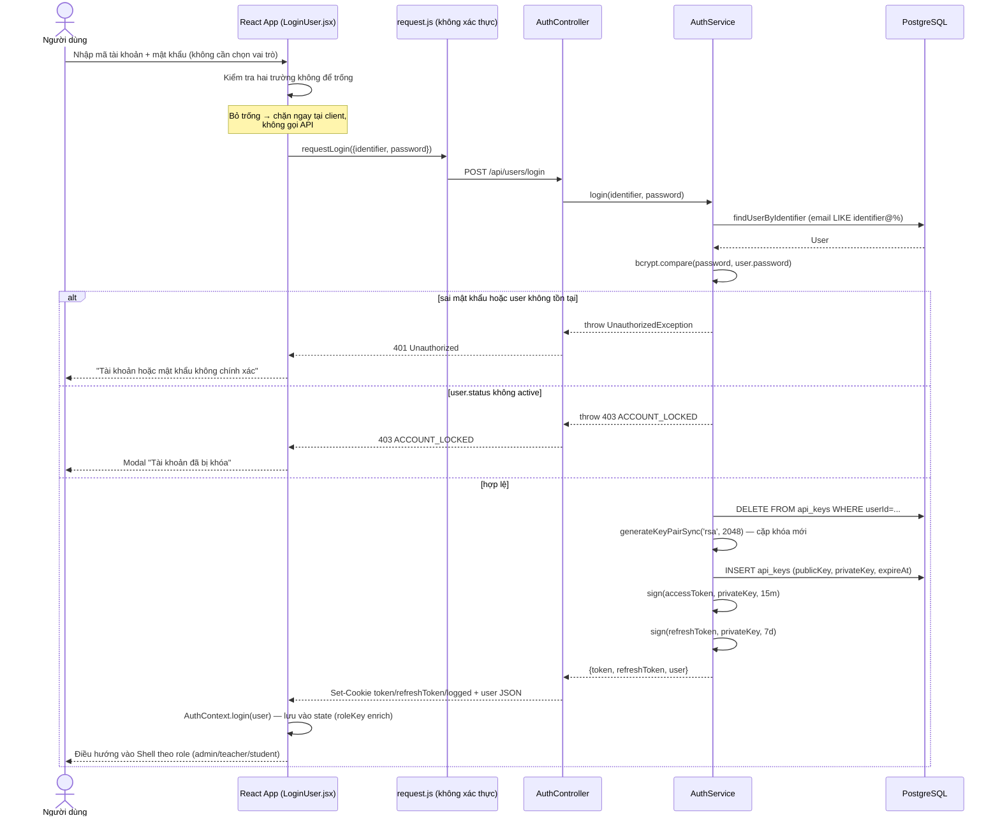
```mermaid
sequenceDiagram
    actor U as Người dùng
    participant C as React App (LoginUser.jsx)
    participant Http as request.js (không xác thực)
    participant Ctrl as AuthController
    participant Svc as AuthService
    participant DB as PostgreSQL

    U->>C: Nhập mã tài khoản + mật khẩu (không cần chọn vai trò)
    C->>C: Kiểm tra hai trường không để trống
    Note over C: Bỏ trống → chặn ngay tại client,<br/>không gọi API
    C->>Http: requestLogin({identifier, password})
    Http->>Ctrl: POST /api/users/login
    Ctrl->>Svc: login(identifier, password)
    Svc->>DB: findUserByIdentifier (email LIKE identifier@%)
    DB-->>Svc: User
    Svc->>Svc: bcrypt.compare(password, user.password)
    alt sai mật khẩu hoặc user không tồn tại
        Svc-->>Ctrl: throw UnauthorizedException
        Ctrl-->>C: 401 Unauthorized
        C-->>U: "Tài khoản hoặc mật khẩu không chính xác"
    else user.status không active
        Svc-->>Ctrl: throw 403 ACCOUNT_LOCKED
        Ctrl-->>C: 403 ACCOUNT_LOCKED
        C-->>U: Modal "Tài khoản đã bị khóa"
    else hợp lệ
        Svc->>DB: DELETE FROM api_keys WHERE userId=...
        Svc->>Svc: generateKeyPairSync('rsa', 2048) — cặp khóa mới
        Svc->>DB: INSERT api_keys (publicKey, privateKey, expireAt)
        Svc->>Svc: sign(accessToken, privateKey, 15m)
        Svc->>Svc: sign(refreshToken, privateKey, 7d)
        Svc-->>Ctrl: {token, refreshToken, user}
        Ctrl-->>C: Set-Cookie token/refreshToken/logged + user JSON
        C->>C: AuthContext.login(user) — lưu vào state (roleKey enrich)
        C-->>U: Điều hướng vào Shell theo role (admin/teacher/student)
    end
```

**Sơ đồ phụ — Làm mới Access Token (401 Interceptor)**: mọi request đã xác thực đều có thể kích hoạt luồng này bất kỳ lúc nào access token hết hạn, không riêng gì sau khi đăng nhập.

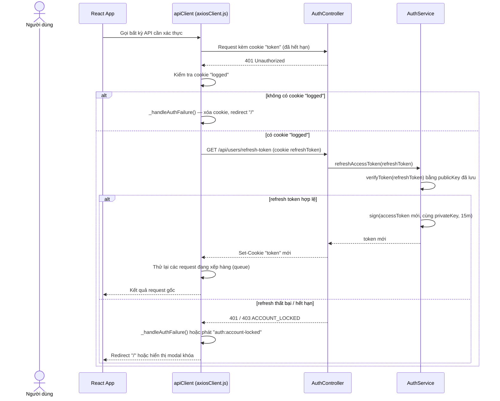
```mermaid
sequenceDiagram
    actor U as Người dùng
    participant C as React App
    participant Api as apiClient (axiosClient.js)
    participant Ctrl as AuthController
    participant Svc as AuthService

    C->>Api: Gọi bất kỳ API cần xác thực
    Api->>Ctrl: Request kèm cookie "token" (đã hết hạn)
    Ctrl-->>Api: 401 Unauthorized
    Api->>Api: Kiểm tra cookie "logged"
    alt không có cookie "logged"
        Api->>Api: _handleAuthFailure() — xóa cookie, redirect "/"
    else có cookie "logged"
        Api->>Ctrl: GET /api/users/refresh-token (cookie refreshToken)
        Ctrl->>Svc: refreshAccessToken(refreshToken)
        Svc->>Svc: verifyToken(refreshToken) bằng publicKey đã lưu
        alt refresh token hợp lệ
            Svc->>Svc: sign(accessToken mới, cùng privateKey, 15m)
            Svc-->>Ctrl: token mới
            Ctrl-->>Api: Set-Cookie "token" mới
            Api->>Api: Thử lại các request đang xếp hàng (queue)
            Api-->>C: Kết quả request gốc
        else refresh thất bại / hết hạn
            Ctrl-->>Api: 401 / 403 ACCOUNT_LOCKED
            Api->>Api: _handleAuthFailure() hoặc phát "auth:account-locked"
            Api-->>C: Redirect "/" hoặc hiển thị modal khóa
        end
    end
```

## 2. UC#02 — Quên mật khẩu → Xác thực OTP → Đặt lại mật khẩu

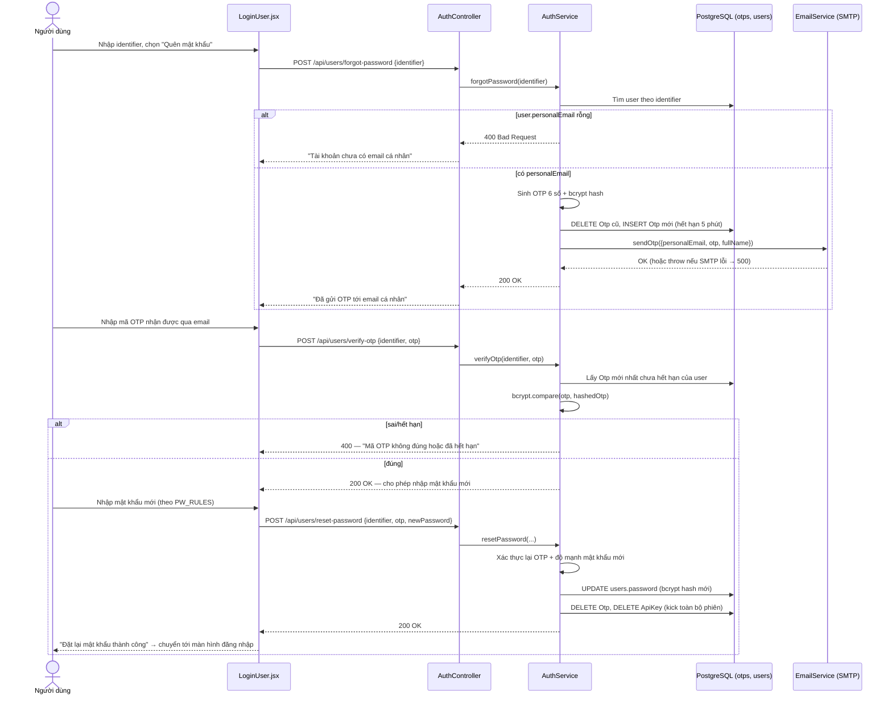
```mermaid
sequenceDiagram
    actor U as Người dùng
    participant C as LoginUser.jsx
    participant Ctrl as AuthController
    participant Svc as AuthService
    participant DB as PostgreSQL (otps, users)
    participant Mail as EmailService (SMTP)

    U->>C: Nhập identifier, chọn "Quên mật khẩu"
    C->>Ctrl: POST /api/users/forgot-password {identifier}
    Ctrl->>Svc: forgotPassword(identifier)
    Svc->>DB: Tìm user theo identifier
    alt user.personalEmail rỗng
        Svc-->>Ctrl: 400 Bad Request
        Ctrl-->>C: "Tài khoản chưa có email cá nhân"
    else có personalEmail
        Svc->>Svc: Sinh OTP 6 số + bcrypt hash
        Svc->>DB: DELETE Otp cũ, INSERT Otp mới (hết hạn 5 phút)
        Svc->>Mail: sendOtp({personalEmail, otp, fullName})
        Mail-->>Svc: OK (hoặc throw nếu SMTP lỗi → 500)
        Svc-->>Ctrl: 200 OK
        Ctrl-->>C: "Đã gửi OTP tới email cá nhân"
    end

    U->>C: Nhập mã OTP nhận được qua email
    C->>Ctrl: POST /api/users/verify-otp {identifier, otp}
    Ctrl->>Svc: verifyOtp(identifier, otp)
    Svc->>DB: Lấy Otp mới nhất chưa hết hạn của user
    Svc->>Svc: bcrypt.compare(otp, hashedOtp)
    alt sai/hết hạn
        Svc-->>C: 400 — "Mã OTP không đúng hoặc đã hết hạn"
    else đúng
        Svc-->>C: 200 OK — cho phép nhập mật khẩu mới
        U->>C: Nhập mật khẩu mới (theo PW_RULES)
        C->>Ctrl: POST /api/users/reset-password {identifier, otp, newPassword}
        Ctrl->>Svc: resetPassword(...)
        Svc->>Svc: Xác thực lại OTP + độ mạnh mật khẩu mới
        Svc->>DB: UPDATE users.password (bcrypt hash mới)
        Svc->>DB: DELETE Otp, DELETE ApiKey (kick toàn bộ phiên)
        Svc-->>C: 200 OK
        C-->>U: "Đặt lại mật khẩu thành công" → chuyển tới màn hình đăng nhập
    end
```

## 3. UC#03 — Đổi mật khẩu

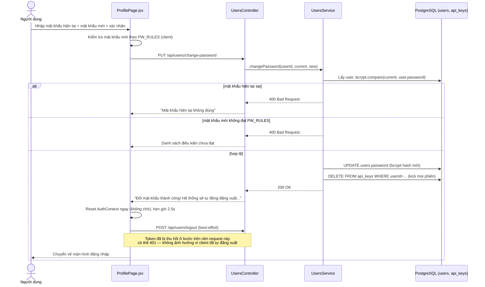
```mermaid
sequenceDiagram
    actor U as Người dùng
    participant C as ProfilePage.jsx
    participant Ctrl as UsersController
    participant Svc as UsersService
    participant DB as PostgreSQL (users, api_keys)

    U->>C: Nhập mật khẩu hiện tại + mật khẩu mới + xác nhận
    C->>C: Kiểm tra mật khẩu mới theo PW_RULES (client)
    C->>Ctrl: PUT /api/users/change-password
    Ctrl->>Svc: changePassword(userId, current, new)
    Svc->>DB: Lấy user, bcrypt.compare(current, user.password)
    alt mật khẩu hiện tại sai
        Svc-->>Ctrl: 400 Bad Request
        Ctrl-->>C: "Mật khẩu hiện tại không đúng"
    else mật khẩu mới không đạt PW_RULES
        Svc-->>Ctrl: 400 Bad Request
        Ctrl-->>C: Danh sách điều kiện chưa đạt
    else hợp lệ
        Svc->>DB: UPDATE users.password (bcrypt hash mới)
        Svc->>DB: DELETE FROM api_keys WHERE userId=... (kick mọi phiên)
        Svc-->>Ctrl: 200 OK
        Ctrl-->>C: "Đổi mật khẩu thành công! Hệ thống sẽ tự động đăng xuất..."
        C->>C: Reset AuthContext ngay (không chờ), hẹn giờ 2.5s
        C->>Ctrl: POST /api/users/logout (best-effort)
        Note over C,Ctrl: Token đã bị thu hồi ở bước trên nên request này<br/>có thể 401 — không ảnh hưởng vì client đã tự đăng xuất
        C-->>U: Chuyển về màn hình đăng nhập
    end
```

## 4. UC#04 — Đăng xuất

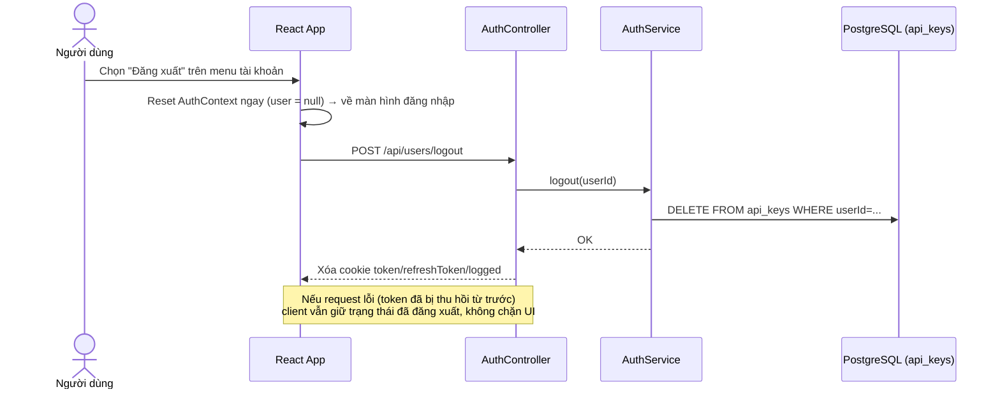
```mermaid
sequenceDiagram
    actor U as Người dùng
    participant C as React App
    participant Ctrl as AuthController
    participant Svc as AuthService
    participant DB as PostgreSQL (api_keys)

    U->>C: Chọn "Đăng xuất" trên menu tài khoản
    C->>C: Reset AuthContext ngay (user = null) → về màn hình đăng nhập
    C->>Ctrl: POST /api/users/logout
    Ctrl->>Svc: logout(userId)
    Svc->>DB: DELETE FROM api_keys WHERE userId=...
    Svc-->>Ctrl: OK
    Ctrl-->>C: Xóa cookie token/refreshToken/logged
    Note over C,Ctrl: Nếu request lỗi (token đã bị thu hồi từ trước)<br/>client vẫn giữ trạng thái đã đăng xuất, không chặn UI
```

## 5. UC#05 — Cập nhật hồ sơ cá nhân

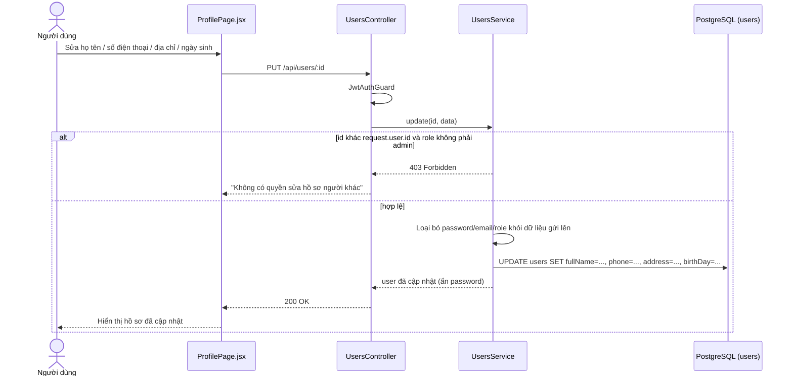
```mermaid
sequenceDiagram
    actor U as Người dùng
    participant C as ProfilePage.jsx
    participant Ctrl as UsersController
    participant Svc as UsersService
    participant DB as PostgreSQL (users)

    U->>C: Sửa họ tên / số điện thoại / địa chỉ / ngày sinh
    C->>Ctrl: PUT /api/users/:id
    Ctrl->>Ctrl: JwtAuthGuard
    Ctrl->>Svc: update(id, data)
    alt id khác request.user.id và role không phải admin
        Svc-->>Ctrl: 403 Forbidden
        Ctrl-->>C: "Không có quyền sửa hồ sơ người khác"
    else hợp lệ
        Svc->>Svc: Loại bỏ password/email/role khỏi dữ liệu gửi lên
        Svc->>DB: UPDATE users SET fullName=..., phone=..., address=..., birthDay=...
        Svc-->>Ctrl: user đã cập nhật (ẩn password)
        Ctrl-->>C: 200 OK
        C-->>U: Hiển thị hồ sơ đã cập nhật
    end
```

## 6. UC#06 — Admin tạo tài khoản Sinh viên / Giảng viên

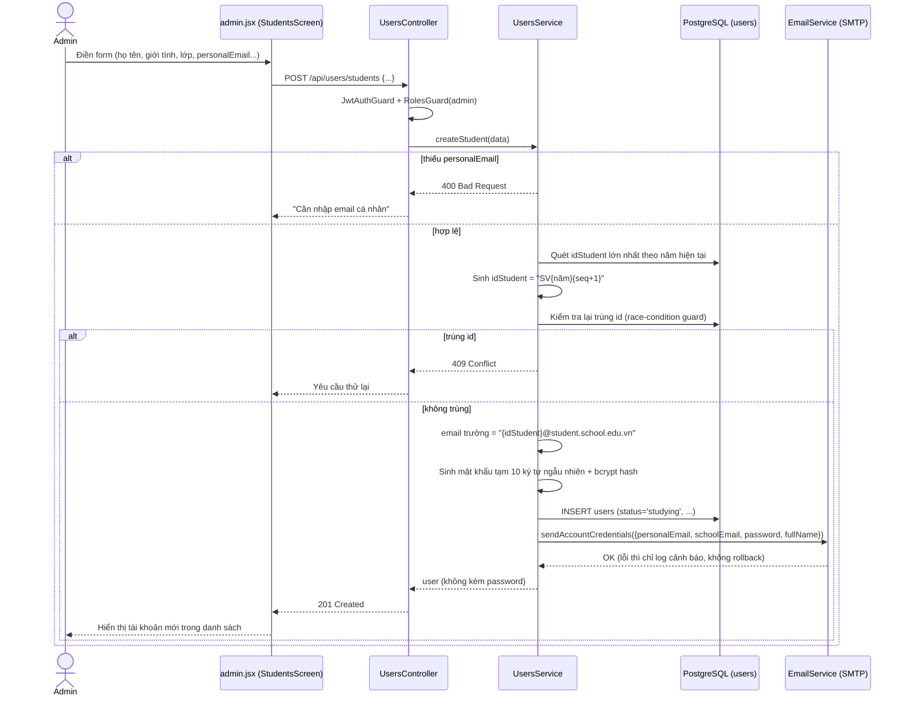
```mermaid
sequenceDiagram
    actor A as Admin
    participant C as admin.jsx (StudentsScreen)
    participant Ctrl as UsersController
    participant Svc as UsersService
    participant DB as PostgreSQL (users)
    participant Mail as EmailService (SMTP)

    A->>C: Điền form (họ tên, giới tính, lớp, personalEmail...)
    C->>Ctrl: POST /api/users/students {...}
    Ctrl->>Ctrl: JwtAuthGuard + RolesGuard(admin)
    Ctrl->>Svc: createStudent(data)
    alt thiếu personalEmail
        Svc-->>Ctrl: 400 Bad Request
        Ctrl-->>C: "Cần nhập email cá nhân"
    else hợp lệ
        Svc->>DB: Quét idStudent lớn nhất theo năm hiện tại
        Svc->>Svc: Sinh idStudent = "SV{năm}{seq+1}"
        Svc->>DB: Kiểm tra lại trùng id (race-condition guard)
        alt trùng id
            Svc-->>Ctrl: 409 Conflict
            Ctrl-->>C: Yêu cầu thử lại
        else không trùng
            Svc->>Svc: email trường = "{idStudent}@student.school.edu.vn"
            Svc->>Svc: Sinh mật khẩu tạm 10 ký tự ngẫu nhiên + bcrypt hash
            Svc->>DB: INSERT users (status='studying', ...)
            Svc->>Mail: sendAccountCredentials({personalEmail, schoolEmail, password, fullName})
            Mail-->>Svc: OK (lỗi thì chỉ log cảnh báo, không rollback)
            Svc-->>Ctrl: user (không kèm password)
            Ctrl-->>C: 201 Created
            C-->>A: Hiển thị tài khoản mới trong danh sách
        end
    end
```

## 7. UC#07 — Nhập danh sách hàng loạt (Bulk Import)

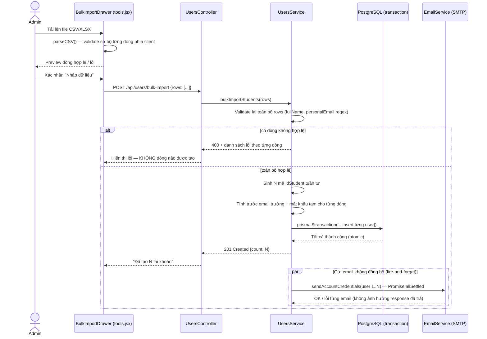
```mermaid
sequenceDiagram
    actor A as Admin
    participant C as BulkImportDrawer (tools.jsx)
    participant Ctrl as UsersController
    participant Svc as UsersService
    participant DB as PostgreSQL (transaction)
    participant Mail as EmailService (SMTP)

    A->>C: Tải lên file CSV/XLSX
    C->>C: parseCSV() — validate sơ bộ từng dòng phía client
    C-->>A: Preview dòng hợp lệ / lỗi
    A->>C: Xác nhận "Nhập dữ liệu"
    C->>Ctrl: POST /api/users/bulk-import {rows: [...]}
    Ctrl->>Svc: bulkImportStudents(rows)
    Svc->>Svc: Validate lại toàn bộ rows (fullName, personalEmail regex)
    alt có dòng không hợp lệ
        Svc-->>Ctrl: 400 + danh sách lỗi theo từng dòng
        Ctrl-->>C: Hiển thị lỗi — KHÔNG dòng nào được tạo
    else toàn bộ hợp lệ
        Svc->>Svc: Sinh N mã idStudent tuần tự
        Svc->>Svc: Tính trước email trường + mật khẩu tạm cho từng dòng
        Svc->>DB: prisma.$transaction([...insert từng user])
        DB-->>Svc: Tất cả thành công (atomic)
        Svc-->>Ctrl: 201 Created {count: N}
        Ctrl-->>C: "Đã tạo N tài khoản"
        par Gửi email không đồng bộ (fire-and-forget)
            Svc->>Mail: sendAccountCredentials(user 1..N) — Promise.allSettled
            Mail-->>Svc: OK / lỗi từng email (không ảnh hưởng response đã trả)
        end
    end
```

## 8. UC#08 — Xem chi tiết & cập nhật thông tin người dùng

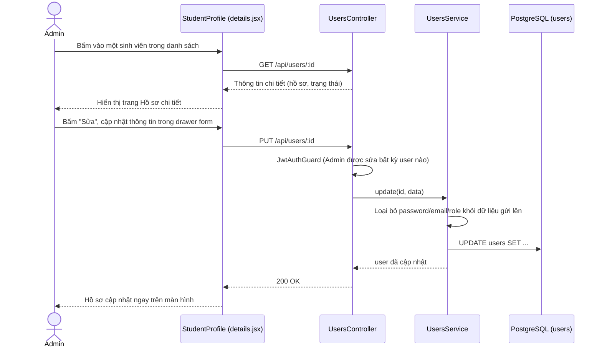
```mermaid
sequenceDiagram
    actor A as Admin
    participant C as StudentProfile (details.jsx)
    participant Ctrl as UsersController
    participant Svc as UsersService
    participant DB as PostgreSQL (users)

    A->>C: Bấm vào một sinh viên trong danh sách
    C->>Ctrl: GET /api/users/:id
    Ctrl-->>C: Thông tin chi tiết (hồ sơ, trạng thái)
    C-->>A: Hiển thị trang Hồ sơ chi tiết
    A->>C: Bấm "Sửa", cập nhật thông tin trong drawer form
    C->>Ctrl: PUT /api/users/:id
    Ctrl->>Ctrl: JwtAuthGuard (Admin được sửa bất kỳ user nào)
    Ctrl->>Svc: update(id, data)
    Svc->>Svc: Loại bỏ password/email/role khỏi dữ liệu gửi lên
    Svc->>DB: UPDATE users SET ...
    Svc-->>Ctrl: user đã cập nhật
    Ctrl-->>C: 200 OK
    C-->>A: Hồ sơ cập nhật ngay trên màn hình
```

## 9. UC#09 — Khóa / mở khóa tài khoản

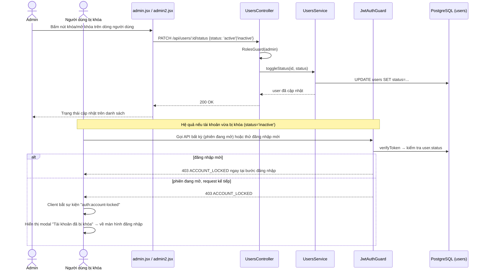
```mermaid
sequenceDiagram
    actor A as Admin
    actor U as Người dùng bị khóa
    participant C as admin.jsx / admin2.jsx
    participant Ctrl as UsersController
    participant Svc as UsersService
    participant Guard as JwtAuthGuard
    participant DB as PostgreSQL (users)

    A->>C: Bấm nút khóa/mở khóa trên dòng người dùng
    C->>Ctrl: PATCH /api/users/:id/status {status: 'active'|'inactive'}
    Ctrl->>Ctrl: RolesGuard(admin)
    Ctrl->>Svc: toggleStatus(id, status)
    Svc->>DB: UPDATE users SET status=...
    Svc-->>Ctrl: user đã cập nhật
    Ctrl-->>C: 200 OK
    C-->>A: Trạng thái cập nhật trên danh sách

    Note over U,Guard: Hệ quả nếu tài khoản vừa bị khóa (status='inactive')
    U->>Guard: Gọi API bất kỳ (phiên đang mở) hoặc thử đăng nhập mới
    Guard->>DB: verifyToken → kiểm tra user.status
    alt đăng nhập mới
        Guard-->>U: 403 ACCOUNT_LOCKED ngay tại bước đăng nhập
    else phiên đang mở, request kế tiếp
        Guard-->>U: 403 ACCOUNT_LOCKED
        U->>U: Client bắt sự kiện "auth:account-locked"
        U->>U: Hiển thị modal "Tài khoản đã bị khóa" → về màn hình đăng nhập
    end
```

## 10. UC#10 — Xóa tài khoản

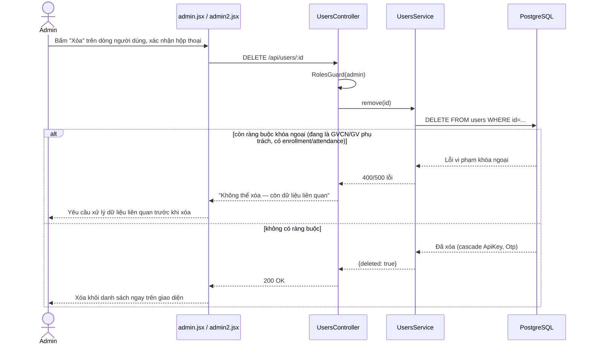
```mermaid
sequenceDiagram
    actor A as Admin
    participant C as admin.jsx / admin2.jsx
    participant Ctrl as UsersController
    participant Svc as UsersService
    participant DB as PostgreSQL

    A->>C: Bấm "Xóa" trên dòng người dùng, xác nhận hộp thoại
    C->>Ctrl: DELETE /api/users/:id
    Ctrl->>Ctrl: RolesGuard(admin)
    Ctrl->>Svc: remove(id)
    Svc->>DB: DELETE FROM users WHERE id=...
    alt còn ràng buộc khóa ngoại (đang là GVCN/GV phụ trách, có enrollment/attendance)
        DB-->>Svc: Lỗi vi phạm khóa ngoại
        Svc-->>Ctrl: 400/500 lỗi
        Ctrl-->>C: "Không thể xóa — còn dữ liệu liên quan"
        C-->>A: Yêu cầu xử lý dữ liệu liên quan trước khi xóa
    else không có ràng buộc
        DB-->>Svc: Đã xóa (cascade ApiKey, Otp)
        Svc-->>Ctrl: {deleted: true}
        Ctrl-->>C: 200 OK
        C-->>A: Xóa khỏi danh sách ngay trên giao diện
    end
```

## 11. UC#11 — Quản lý danh mục (Khoa / Ngành / Lớp / Môn học)

```mermaid
sequenceDiagram
    actor A as Admin
    participant C as admin2.jsx
    participant Ctrl as Departments/Branches/Classes/SubjectsController
    participant Svc as *.Service
    participant DB as PostgreSQL

    A->>C: Mở màn hình danh mục (Khoa/Ngành/Lớp/Môn học)
    C->>Ctrl: GET /api/departments | /branches | /classes?branchId | /subjects?branchId
    Ctrl-->>C: Danh sách hiện có
    A->>C: Thêm/sửa — nhập mã + tên, chọn cha (Khoa cho Ngành; Ngành cho Lớp/Môn học)
    C->>Ctrl: POST hoặc PUT tương ứng
    Ctrl->>Ctrl: RolesGuard(admin)
    Ctrl->>Svc: create(...) / update(...)
    alt trùng mã (code unique)
        Svc-->>Ctrl: 409 Conflict
        Ctrl-->>C: "Mã đã tồn tại"
    else hợp lệ
        Svc->>DB: INSERT/UPDATE
        Svc-->>Ctrl: bản ghi mới/đã cập nhật
        Ctrl-->>C: 200/201
        C-->>A: Danh sách cập nhật ngay
    end

    A->>C: Xóa một mục
    C->>Ctrl: DELETE .../:id
    Ctrl->>Svc: remove(id)
    alt còn dữ liệu con tham chiếu (Khoa còn Ngành; Ngành còn Lớp/Môn học)
        Svc->>DB: DELETE bị PostgreSQL từ chối (khóa ngoại)
        Svc-->>Ctrl: lỗi
        Ctrl-->>C: "Không thể xóa — còn dữ liệu phụ thuộc"
    else không còn ràng buộc
        Svc->>DB: DELETE thành công
        Ctrl-->>C: 200 OK
    end
```

## 12. UC#12 — Quản lý Lớp học phần & Học kỳ

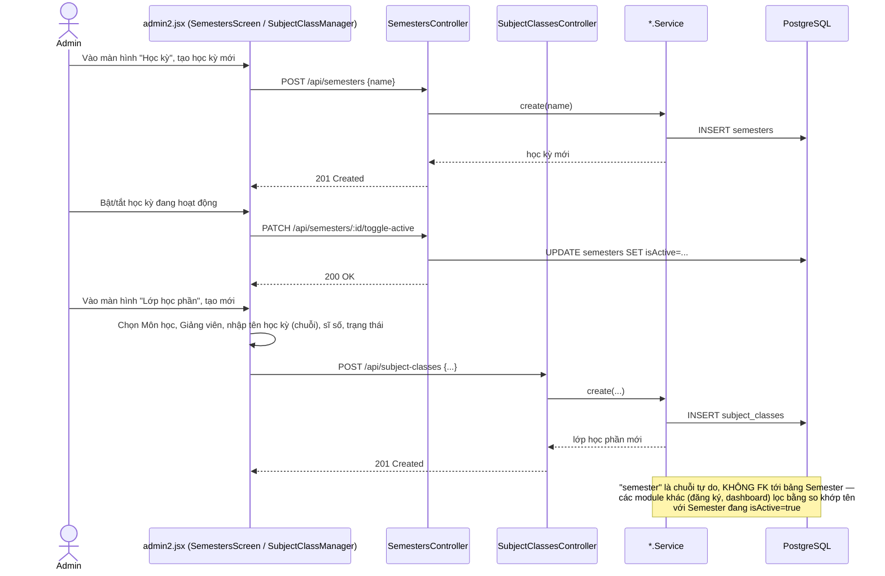
```mermaid
sequenceDiagram
    actor A as Admin
    participant C as admin2.jsx (SemestersScreen / SubjectClassManager)
    participant SCtrl as SemestersController
    participant CCtrl as SubjectClassesController
    participant Svc as *.Service
    participant DB as PostgreSQL

    A->>C: Vào màn hình "Học kỳ", tạo học kỳ mới
    C->>SCtrl: POST /api/semesters {name}
    SCtrl->>Svc: create(name)
    Svc->>DB: INSERT semesters
    Svc-->>SCtrl: học kỳ mới
    SCtrl-->>C: 201 Created

    A->>C: Bật/tắt học kỳ đang hoạt động
    C->>SCtrl: PATCH /api/semesters/:id/toggle-active
    SCtrl->>DB: UPDATE semesters SET isActive=...
    SCtrl-->>C: 200 OK

    A->>C: Vào màn hình "Lớp học phần", tạo mới
    C->>C: Chọn Môn học, Giảng viên, nhập tên học kỳ (chuỗi), sĩ số, trạng thái
    C->>CCtrl: POST /api/subject-classes {...}
    CCtrl->>Svc: create(...)
    Svc->>DB: INSERT subject_classes
    Svc-->>CCtrl: lớp học phần mới
    CCtrl-->>C: 201 Created
    Note over Svc,DB: "semester" là chuỗi tự do, KHÔNG FK tới bảng Semester —<br/>các module khác (đăng ký, dashboard) lọc bằng so khớp tên<br/>với Semester đang isActive=true
```

## 13. UC#13 — Xuất danh sách (CSV / Excel)

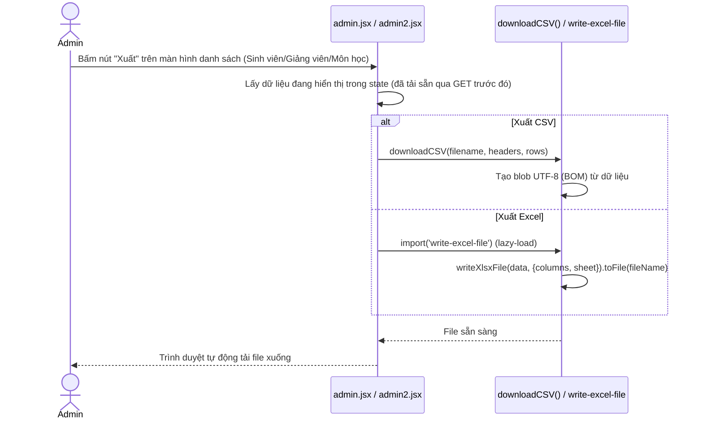
```mermaid
sequenceDiagram
    actor A as Admin
    participant C as admin.jsx / admin2.jsx
    participant Lib as downloadCSV() / write-excel-file

    A->>C: Bấm nút "Xuất" trên màn hình danh sách (Sinh viên/Giảng viên/Môn học)
    C->>C: Lấy dữ liệu đang hiển thị trong state (đã tải sẵn qua GET trước đó)
    alt Xuất CSV
        C->>Lib: downloadCSV(filename, headers, rows)
        Lib->>Lib: Tạo blob UTF-8 (BOM) từ dữ liệu
    else Xuất Excel
        C->>Lib: import('write-excel-file') (lazy-load)
        Lib->>Lib: writeXlsxFile(data, {columns, sheet}).toFile(fileName)
    end
    Lib-->>C: File sẵn sàng
    C-->>A: Trình duyệt tự động tải file xuống
```

## 14. UC#14 — Xem lớp phụ trách & danh sách sinh viên

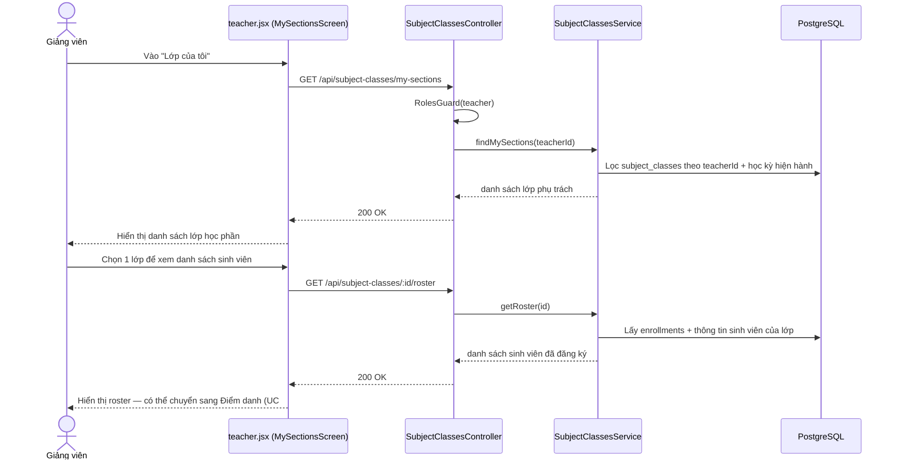
```mermaid
sequenceDiagram
    actor T as Giảng viên
    participant C as teacher.jsx (MySectionsScreen)
    participant Ctrl as SubjectClassesController
    participant Svc as SubjectClassesService
    participant DB as PostgreSQL

    T->>C: Vào "Lớp của tôi"
    C->>Ctrl: GET /api/subject-classes/my-sections
    Ctrl->>Ctrl: RolesGuard(teacher)
    Ctrl->>Svc: findMySections(teacherId)
    Svc->>DB: Lọc subject_classes theo teacherId + học kỳ hiện hành
    Svc-->>Ctrl: danh sách lớp phụ trách
    Ctrl-->>C: 200 OK
    C-->>T: Hiển thị danh sách lớp học phần

    T->>C: Chọn 1 lớp để xem danh sách sinh viên
    C->>Ctrl: GET /api/subject-classes/:id/roster
    Ctrl->>Svc: getRoster(id)
    Svc->>DB: Lấy enrollments + thông tin sinh viên của lớp
    Svc-->>Ctrl: danh sách sinh viên đã đăng ký
    Ctrl-->>C: 200 OK
    C-->>T: Hiển thị roster — có thể chuyển sang Điểm danh (UC#15) hoặc Nhập điểm (UC#16)
```

## 15. UC#15 — Điểm danh sinh viên

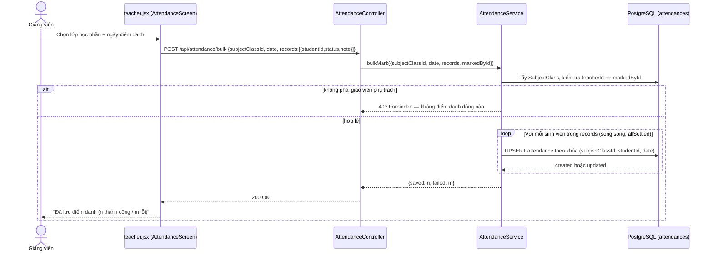
```mermaid
sequenceDiagram
    actor T as Giảng viên
    participant C as teacher.jsx (AttendanceScreen)
    participant Ctrl as AttendanceController
    participant Svc as AttendanceService
    participant DB as PostgreSQL (attendances)

    T->>C: Chọn lớp học phần + ngày điểm danh
    C->>Ctrl: POST /api/attendance/bulk {subjectClassId, date, records:[{studentId,status,note}]}
    Ctrl->>Svc: bulkMark({subjectClassId, date, records, markedById})
    Svc->>DB: Lấy SubjectClass, kiểm tra teacherId == markedById
    alt không phải giáo viên phụ trách
        Svc-->>Ctrl: 403 Forbidden — không điểm danh dòng nào
    else hợp lệ
        loop Với mỗi sinh viên trong records (song song, allSettled)
            Svc->>DB: UPSERT attendance theo khóa (subjectClassId, studentId, date)
            DB-->>Svc: created hoặc updated
        end
        Svc-->>Ctrl: {saved: n, failed: m}
        Ctrl-->>C: 200 OK
        C-->>T: "Đã lưu điểm danh (n thành công / m lỗi)"
    end
```

## 16. UC#16 — Nhập điểm & Khóa điểm

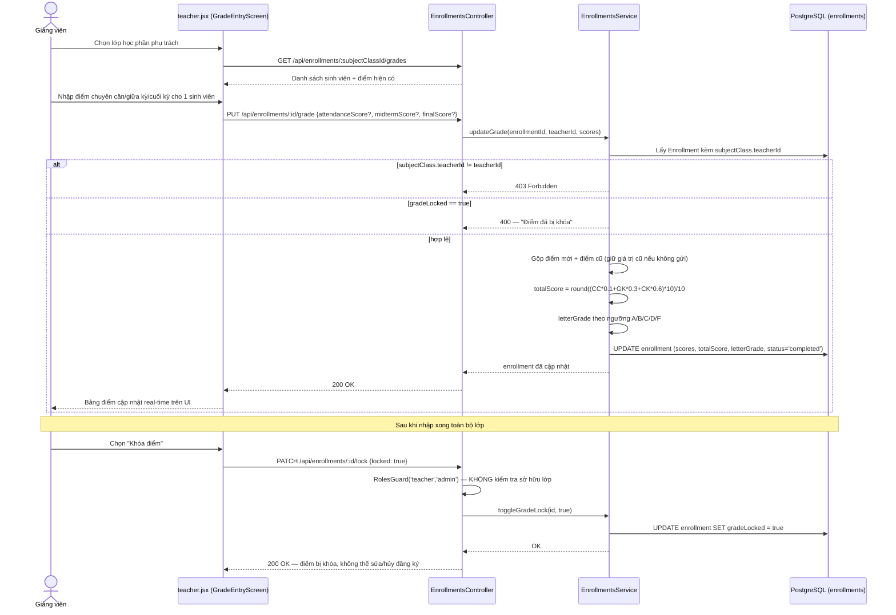
```mermaid
sequenceDiagram
    actor T as Giảng viên
    participant C as teacher.jsx (GradeEntryScreen)
    participant Ctrl as EnrollmentsController
    participant Svc as EnrollmentsService
    participant DB as PostgreSQL (enrollments)

    T->>C: Chọn lớp học phần phụ trách
    C->>Ctrl: GET /api/enrollments/:subjectClassId/grades
    Ctrl-->>C: Danh sách sinh viên + điểm hiện có
    T->>C: Nhập điểm chuyên cần/giữa kỳ/cuối kỳ cho 1 sinh viên
    C->>Ctrl: PUT /api/enrollments/:id/grade {attendanceScore?, midtermScore?, finalScore?}
    Ctrl->>Svc: updateGrade(enrollmentId, teacherId, scores)
    Svc->>DB: Lấy Enrollment kèm subjectClass.teacherId
    alt subjectClass.teacherId != teacherId
        Svc-->>Ctrl: 403 Forbidden
    else gradeLocked == true
        Svc-->>Ctrl: 400 — "Điểm đã bị khóa"
    else hợp lệ
        Svc->>Svc: Gộp điểm mới + điểm cũ (giữ giá trị cũ nếu không gửi)
        Svc->>Svc: totalScore = round((CC*0.1+GK*0.3+CK*0.6)*10)/10
        Svc->>Svc: letterGrade theo ngưỡng A/B/C/D/F
        Svc->>DB: UPDATE enrollment (scores, totalScore, letterGrade, status='completed')
        Svc-->>Ctrl: enrollment đã cập nhật
        Ctrl-->>C: 200 OK
        C-->>T: Bảng điểm cập nhật real-time trên UI
    end

    Note over T,DB: Sau khi nhập xong toàn bộ lớp
    T->>C: Chọn "Khóa điểm"
    C->>Ctrl: PATCH /api/enrollments/:id/lock {locked: true}
    Ctrl->>Ctrl: RolesGuard('teacher','admin') — KHÔNG kiểm tra sở hữu lớp
    Ctrl->>Svc: toggleGradeLock(id, true)
    Svc->>DB: UPDATE enrollment SET gradeLocked = true
    Svc-->>Ctrl: OK
    Ctrl-->>C: 200 OK — điểm bị khóa, không thể sửa/hủy đăng ký
```

## 17. UC#17 — Đăng ký học phần

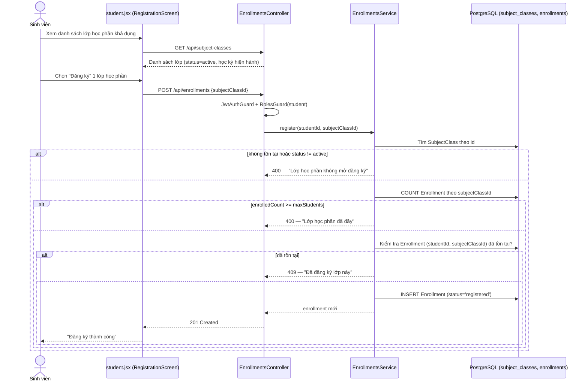
```mermaid
sequenceDiagram
    actor S as Sinh viên
    participant C as student.jsx (RegistrationScreen)
    participant Ctrl as EnrollmentsController
    participant Svc as EnrollmentsService
    participant DB as PostgreSQL (subject_classes, enrollments)

    S->>C: Xem danh sách lớp học phần khả dụng
    C->>Ctrl: GET /api/subject-classes
    Ctrl-->>C: Danh sách lớp (status=active, học kỳ hiện hành)
    S->>C: Chọn "Đăng ký" 1 lớp học phần
    C->>Ctrl: POST /api/enrollments {subjectClassId}
    Ctrl->>Ctrl: JwtAuthGuard + RolesGuard(student)
    Ctrl->>Svc: register(studentId, subjectClassId)
    Svc->>DB: Tìm SubjectClass theo id
    alt không tồn tại hoặc status != active
        Svc-->>Ctrl: 400 — "Lớp học phần không mở đăng ký"
    else
        Svc->>DB: COUNT Enrollment theo subjectClassId
        alt enrolledCount >= maxStudents
            Svc-->>Ctrl: 400 — "Lớp học phần đã đầy"
        else
            Svc->>DB: Kiểm tra Enrollment (studentId, subjectClassId) đã tồn tại?
            alt đã tồn tại
                Svc-->>Ctrl: 409 — "Đã đăng ký lớp này"
            else
                Svc->>DB: INSERT Enrollment (status='registered')
                Svc-->>Ctrl: enrollment mới
                Ctrl-->>C: 201 Created
                C-->>S: "Đăng ký thành công"
            end
        end
    end
```

## 18. UC#18 — Hủy đăng ký học phần

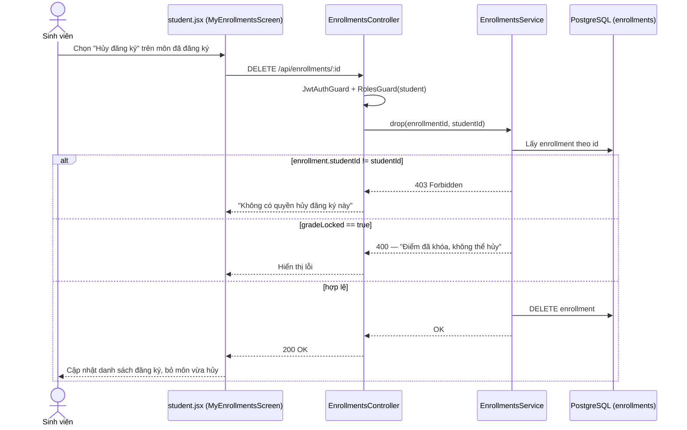
```mermaid
sequenceDiagram
    actor S as Sinh viên
    participant C as student.jsx (MyEnrollmentsScreen)
    participant Ctrl as EnrollmentsController
    participant Svc as EnrollmentsService
    participant DB as PostgreSQL (enrollments)

    S->>C: Chọn "Hủy đăng ký" trên môn đã đăng ký
    C->>Ctrl: DELETE /api/enrollments/:id
    Ctrl->>Ctrl: JwtAuthGuard + RolesGuard(student)
    Ctrl->>Svc: drop(enrollmentId, studentId)
    Svc->>DB: Lấy enrollment theo id
    alt enrollment.studentId != studentId
        Svc-->>Ctrl: 403 Forbidden
        Ctrl-->>C: "Không có quyền hủy đăng ký này"
    else gradeLocked == true
        Svc-->>Ctrl: 400 — "Điểm đã khóa, không thể hủy"
        Ctrl-->>C: Hiển thị lỗi
    else hợp lệ
        Svc->>DB: DELETE enrollment
        Svc-->>Ctrl: OK
        Ctrl-->>C: 200 OK
        C-->>S: Cập nhật danh sách đăng ký, bỏ môn vừa hủy
    end
```

## 19. UC#19 — Xem môn đã đăng ký & lịch học / lịch dạy

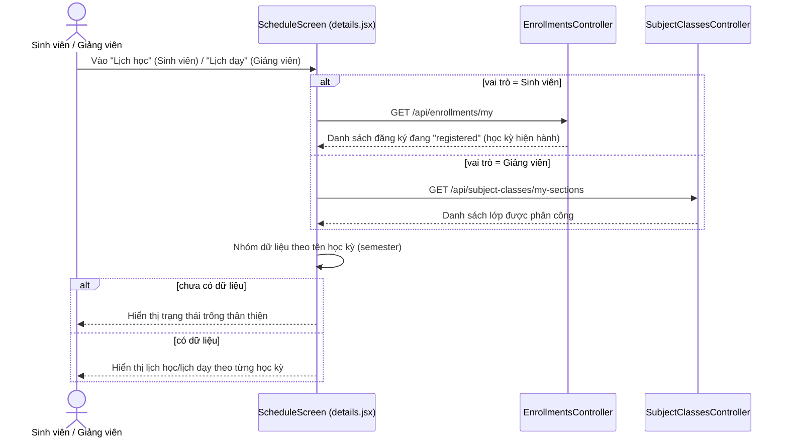
```mermaid
sequenceDiagram
    actor U as Sinh viên / Giảng viên
    participant C as ScheduleScreen (details.jsx)
    participant SCtrl as EnrollmentsController
    participant TCtrl as SubjectClassesController

    U->>C: Vào "Lịch học" (Sinh viên) / "Lịch dạy" (Giảng viên)
    alt vai trò = Sinh viên
        C->>SCtrl: GET /api/enrollments/my
        SCtrl-->>C: Danh sách đăng ký đang "registered" (học kỳ hiện hành)
    else vai trò = Giảng viên
        C->>TCtrl: GET /api/subject-classes/my-sections
        TCtrl-->>C: Danh sách lớp được phân công
    end
    C->>C: Nhóm dữ liệu theo tên học kỳ (semester)
    alt chưa có dữ liệu
        C-->>U: Hiển thị trạng thái trống thân thiện
    else có dữ liệu
        C-->>U: Hiển thị lịch học/lịch dạy theo từng học kỳ
    end
```

## 20. UC#20 — Xem bảng điểm & GPA

```mermaid
sequenceDiagram
    actor S as Sinh viên
    participant C as student.jsx (TranscriptScreen)
    participant Ctrl as EnrollmentsController
    participant Svc as EnrollmentsService
    participant DB as PostgreSQL (enrollments)

    S->>C: Vào "Bảng điểm"
    C->>Ctrl: GET /api/enrollments/transcript
    Ctrl->>Svc: getTranscript(studentId)
    Svc->>DB: Lấy enrollments status='completed' kèm subject.credits
    Svc->>Svc: gpa = round(Σ(totalScore×credits) / Σ(credits), 2)
    Svc-->>Ctrl: {enrollments, gpa, totalCredits}
    Ctrl-->>C: 200 OK
    C-->>S: Hiển thị bảng điểm từng môn + GPA tổng

    C->>Ctrl: GET /api/enrollments/gpa-trend
    Ctrl->>Svc: getGpaTrend(studentId)
    Svc->>DB: Nhóm enrollments completed theo subjectClass.semester
    Svc->>Svc: Tính GPA riêng từng học kỳ, sắp xếp theo tên học kỳ
    Svc-->>Ctrl: [{term, gpa}, ...]
    Ctrl-->>C: 200 OK
    C-->>S: Hiển thị biểu đồ xu hướng GPA theo học kỳ
```

## 21. UC#21 — Xem thống kê Dashboard

```mermaid
sequenceDiagram
    actor U as Người dùng (Admin/Giảng viên/Sinh viên)
    participant C as React App (Dashboard)
    participant Ctrl as DashboardController
    participant Svc as DashboardService
    participant DB as PostgreSQL

    U->>C: Mở màn hình Dashboard
    alt role = admin
        C->>Ctrl: GET /api/dashboard
        Ctrl->>Svc: getStats()
        Svc->>DB: Đếm song song: users, subject_classes, subjects, departments,<br/>groupBy letterGrade, enrollments 7 ngày gần nhất
        Svc-->>Ctrl: {students, teachers, sections, gradeDist, ...}
    else role = teacher
        C->>Ctrl: GET /api/dashboard/teacher
        Ctrl->>Svc: getTeacherStats(teacherId)
        Svc->>DB: Lọc lớp phụ trách theo học kỳ hiện hành (Semester.isActive)
        Svc->>DB: Tính tỷ lệ điểm danh, số bài chưa chấm, xu hướng 8 buổi gần nhất
        Svc-->>Ctrl: {totalSections, attendanceRate, pendingGrades, attendanceTrend}
    else role = student
        C->>Ctrl: GET /api/dashboard/student
        Ctrl->>Svc: getStudentStats(studentId)
        Svc->>DB: Lấy enrollment hiện tại + completed, tính GPA, tỷ lệ điểm danh
        Svc-->>Ctrl: {currentCredits, gpa, attendanceRate, gpaTrend}
    end
    Ctrl-->>C: JSON metadata
    C-->>U: Render StatCard + biểu đồ (recharts/chart.js)
```

## 22. Ghi chú tổng hợp áp dụng cho mọi sơ đồ trên

- Mọi request "đã xác thực" đều đi qua `apiClient` (`axiosClient.js`) → tự động gắn cookie (`withCredentials: true`) và tự làm mới token khi gặp 401 (xem sơ đồ phụ ở mục 1) trước khi tới được sơ đồ nghiệp vụ tương ứng — các sơ đồ từ mục 3 trở đi lược bỏ bước này để tập trung vào nghiệp vụ chính.
- Guard áp dụng theo thứ tự: `JwtAuthGuard` (xác thực) → `RolesGuard` + `@Roles(...)` (phân quyền) — nếu request không qua guard, controller/service không được gọi tới.
- Định dạng response thành công chuẩn của server: `{ success, message, metadata }`; lỗi được NestJS tự serialize từ các `HttpException` (`BadRequestException`, `ForbiddenException`, `ConflictException`, `UnauthorizedException`...).
- UC#13 (Xuất CSV/Excel) là luồng thuần phía client — không có lời gọi API riêng để "xuất"; dữ liệu đã có sẵn trong state từ các lần `GET` trước đó.
