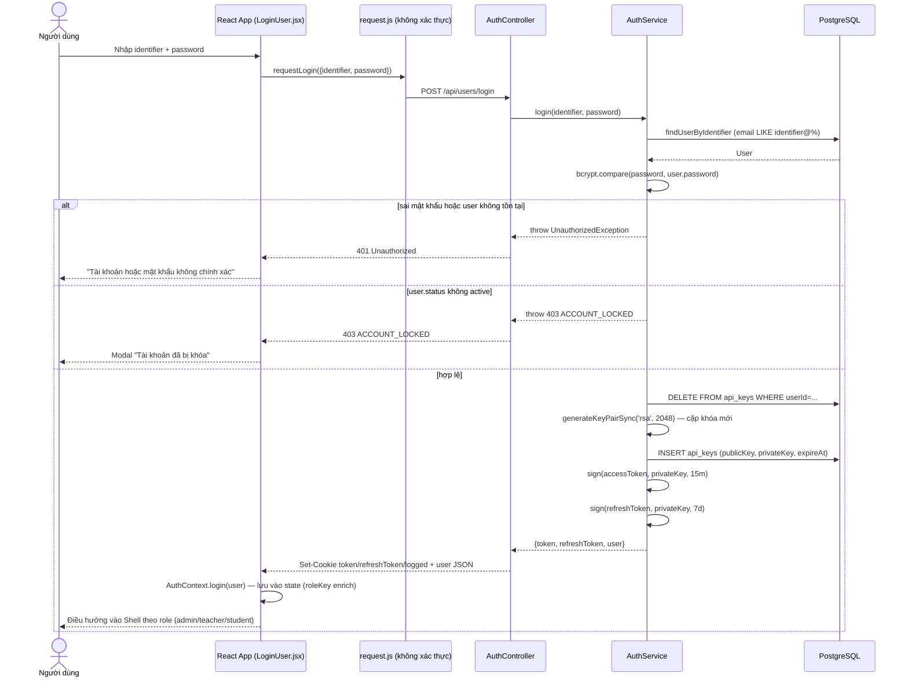
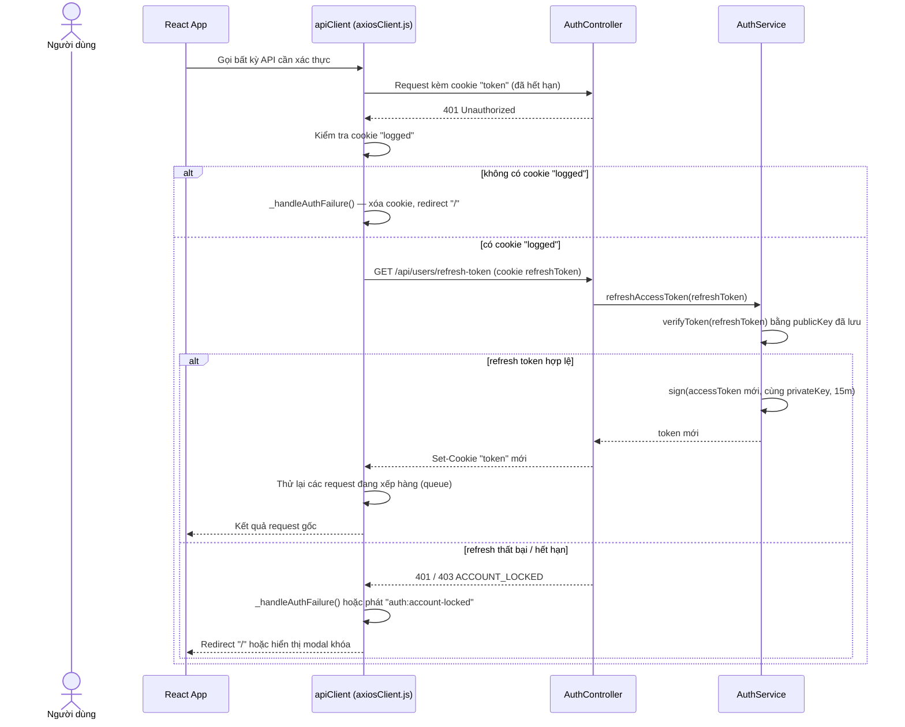
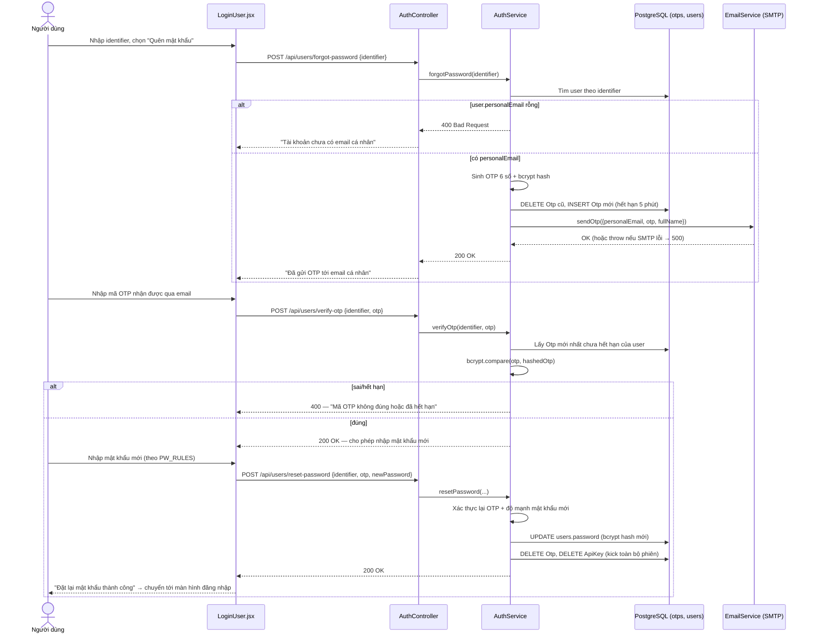
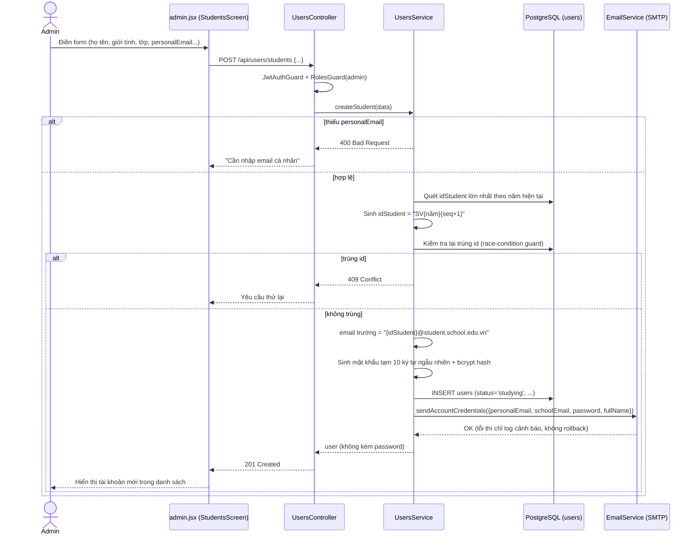
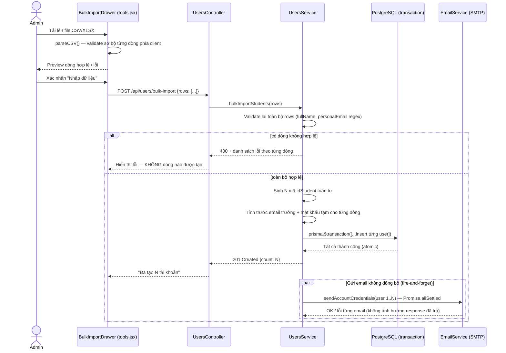
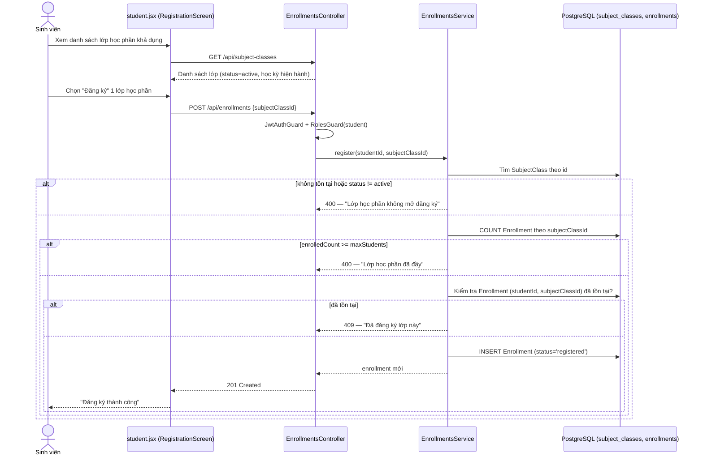
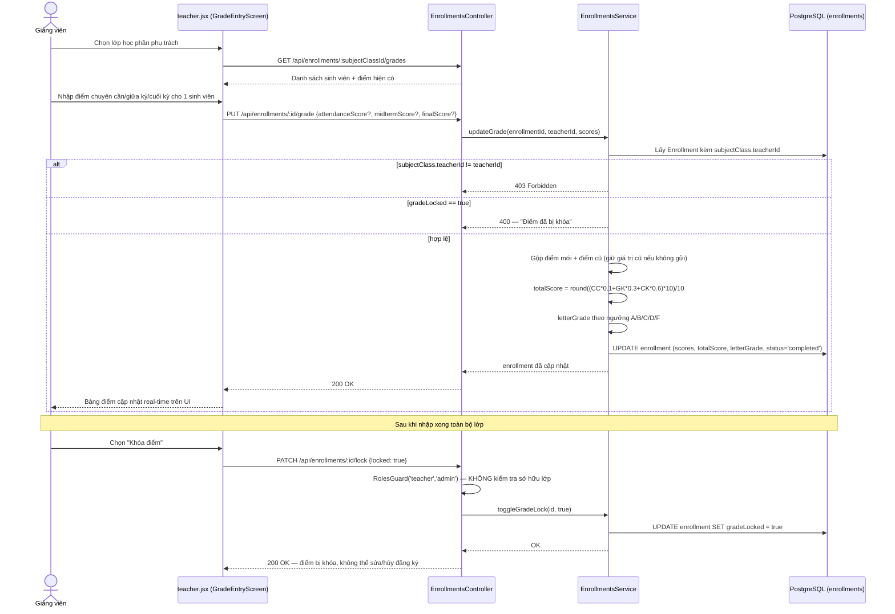
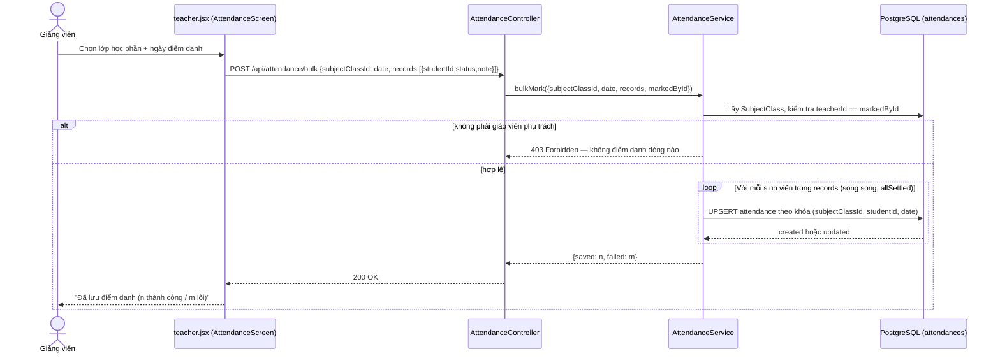
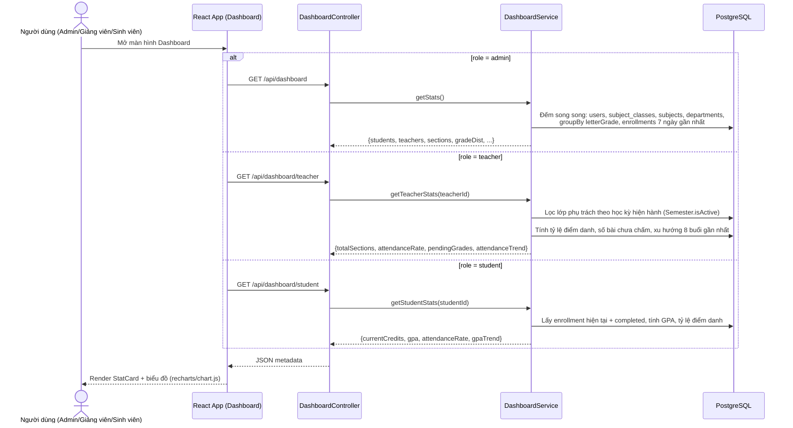

# Sơ Đồ Tuần Tự (Sequence Diagram) — Các Luồng Nghiệp Vụ Chính

> Vẽ bằng Mermaid `sequenceDiagram` (render trực tiếp trong Markdown/VS Code/GitHub) thay cho hình ảnh UML chèn tay như trong tài liệu mẫu (`00-phan-tich-tai-lieu-mau.md`, mục 3.4). Mỗi sơ đồ tương ứng với một Use Case trong `03-usecase-nghiep-vu.md`. Chi tiết kỹ thuật (tên hàm, bảng, guard) được lấy trực tiếp từ mã nguồn hiện tại của `server_side/` và `client_side/`.

## 1. Đăng nhập (UC#01)

## 2. Làm mới Access Token (401 Interceptor)

## 3. Quên mật khẩu → Xác thực OTP → Đặt lại mật khẩu (UC#02)

## 4. Admin tạo tài khoản Sinh viên (UC#05)

## 5. Nhập danh sách hàng loạt — Bulk Import (UC#06)

## 6. Sinh viên đăng ký học phần (UC#08)

## 7. Giảng viên nhập điểm & khóa điểm (UC#10)

## 8. Giảng viên điểm danh hàng loạt (UC#11)

## 9. Xem Dashboard theo vai trò (UC#12)

## 10. Ghi chú tổng hợp áp dụng cho mọi sơ đồ trên

- Mọi request "đã xác thực" đều đi qua `apiClient` (`axiosClient.js`) → tự động gắn cookie (`withCredentials: true`) và tự làm mới token khi gặp 401 (xem sơ đồ mục 2) trước khi tới được sơ đồ nghiệp vụ tương ứng — các sơ đồ 4–9 lược bỏ bước này để tập trung vào nghiệp vụ chính.
- Guard áp dụng theo thứ tự: `JwtAuthGuard` (xác thực) → `RolesGuard` + `@Roles(...)` (phân quyền) — nếu request không qua guard, controller/service không được gọi tới.
- Định dạng response thành công chuẩn của server: `{ success, message, metadata }`; lỗi được NestJS tự serialize từ các `HttpException` (`BadRequestException`, `ForbiddenException`, `ConflictException`, `UnauthorizedException`...).
